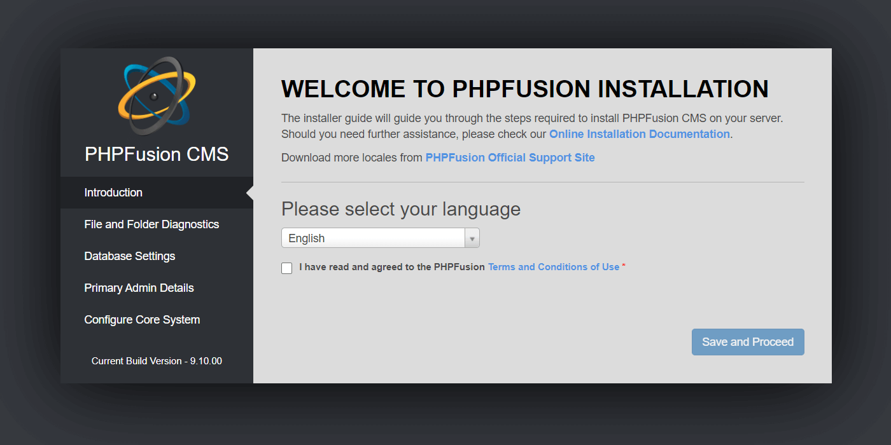
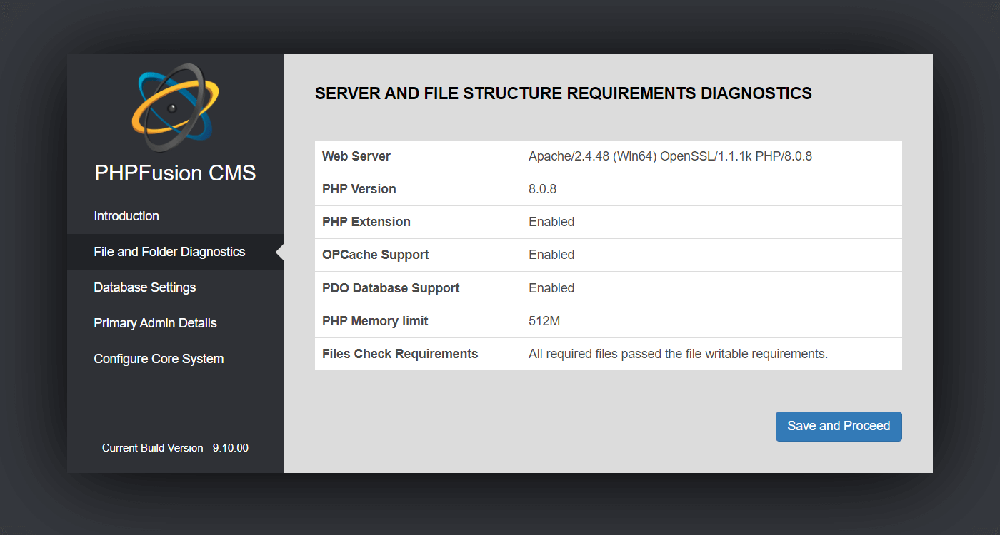
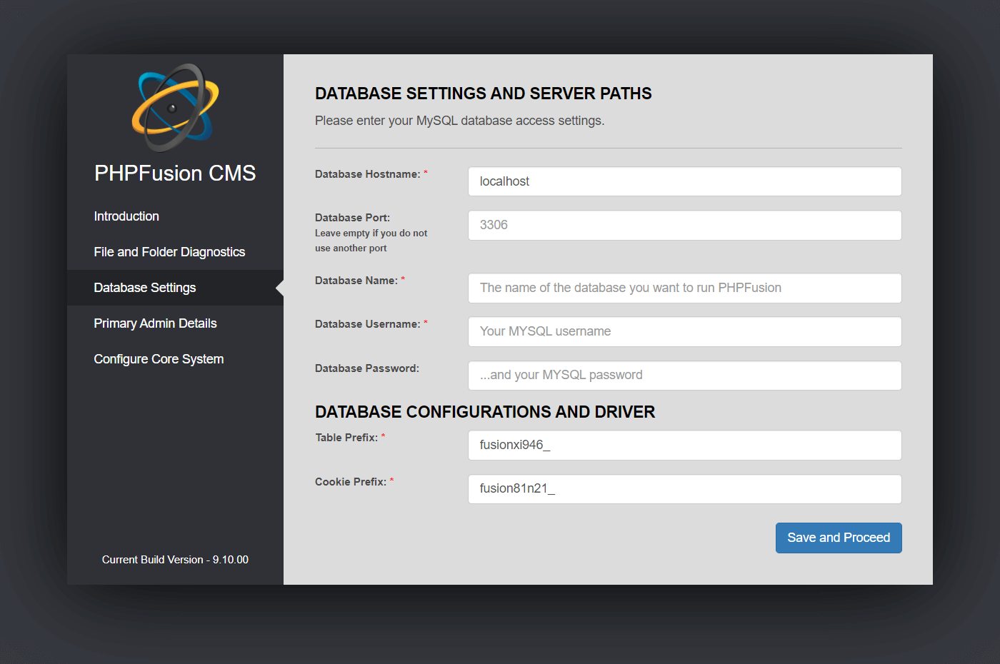
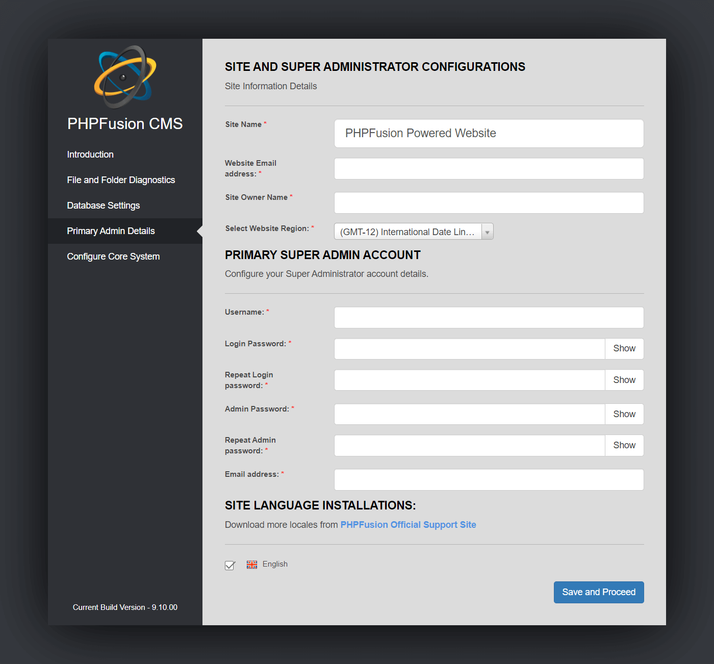
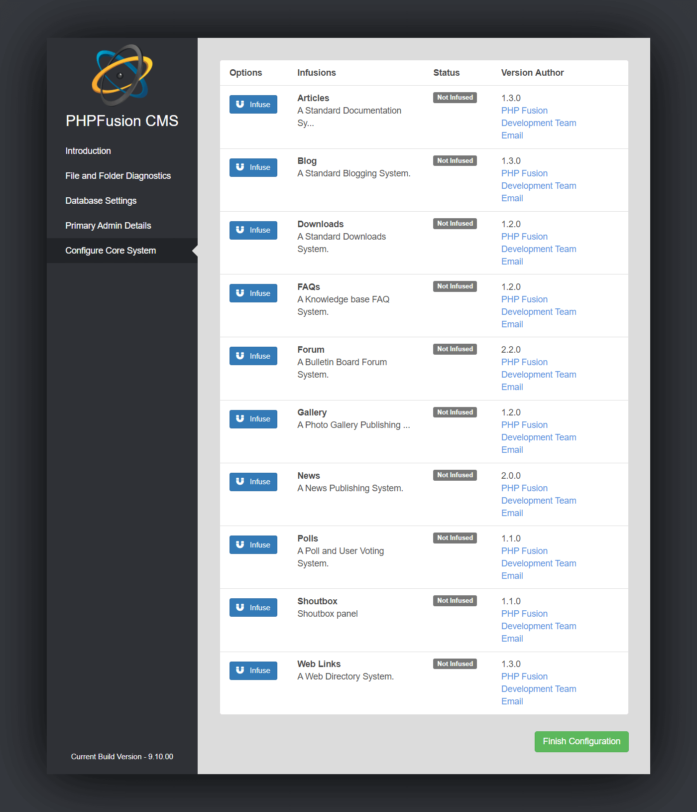
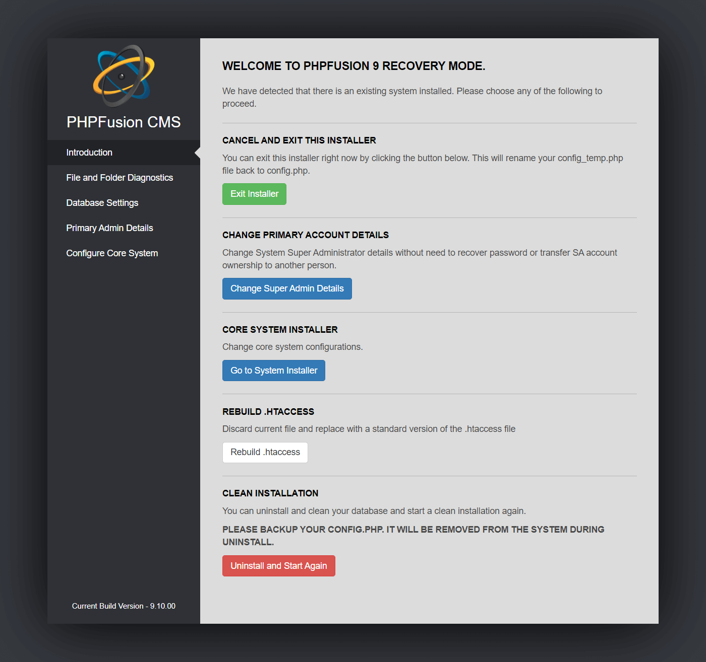

# Installation

---

## Create a database

You need to create a MySQL database. You can do this via your web hosting's control panel or phpMyAdmin.

Make sure you have your MySQL access details at hand including the hostname, username, password and database name as you will need to specify these during setup.

## Pre-installation Checks

Before you start the installation of PHPFusion you must upload all the files to your hosted directory and set the correct permissions for the files listed below.

Unless you run PHPFusion on a local server, in most cases you will need to CHMOD the following files and folders to 777

 - administration/db_backups/
 - images/
 - images/avatars/
 - images/smiley/
 - robots.txt

Infusions shipped with the Core requires the following folders to be CHMODed to 777:
 - infusions/articles/images/
 - infusions/articles/images/thumbs/
 - infusions/blog/images/
 - infusions/blog/images/thumbs/
 - infusions/downloads/files/
 - infusions/downloads/images/
 - infusions/downloads/submissions/
 - infusions/downloads/submissions/images/
 - infusions/forum/attachments/
 - infusions/forum/images/
 - infusions/gallery/photos/
 - infusions/gallery/photos/thumbs/
 - infusions/gallery/submissions/
 - infusions/gallery/submissions/thumbs/
 - infusions/news/images/
 - infusions/news/images/thumbs/

Note: Some hosts does not allow CHMOD 777, in that case you can use CHMOD 755 if CHMOD 777 fails.

This can be done either in your FTP program or from your hosts control panel.

To begin the installation PHPFusion you need to open your web browser and navigate to your site.

Go to your website where install should start automatically. If not, you should run the installer manually by entering your full site url followed by /install.php Example: `https://yourdomain.com/install.php`.

## Step 1

Select your default language for the site.

If you wish to install your site using a different language or if you want to use multiple languages, you need to first download the desired locale files from our [Tranaltions page](https://www.php-fusion.co.uk/translations/).

You can always add an unlimited amount of languages or change the default system language at any given point later from the Language Administration.

You must Agree and check the box before "I have read and agreed to the PHPFusion Terms and Conditions of Use".

## Step 2

If you have set the correct permissions you should see "All required files passed the file writable requirements.".

## Step 3

Enter in your database information, leave Database Hostname set as "localhost" unless otherwise told to by your host.

Leave Database Port empty if you do not use another port.

The table and cookie prefixes are randomly generated as a security measure.

You do not need to alter these settings. However, you can enter your own prefixes if you wish to do so.

The only stipulation is that they are random letters and numbers and are unique. If you are unsure, leave them as they are.

If for any reason, you receive a warning message, go back and re-check that you have entered the correct details and that the database (MySQL) user has read, write and delete permission for the selected database.

## Step 4

You now need to enter the details for the Primary user that we call Super Administrator and Site information.

It is recommended that you as a Super Administrator use random letters, numbers and characters to prevent anyone ever gains access to your account as the first Super Administrator has complete access to every section of the site.

Do not use your name, date of birth or part of your phone number or any other personal details that can be guessed by others.

All the main browsers have built in password managers, thereby relieving you of the need to remember them.

The Admin Password is your password to enter the Administration Area, this password should also not be easy to guess.

## Step 5

Your database tables have been successfully created and populated with the required default data.

You can now select what Infusions you want pre-installed or simply click Finish Configuration to complete the installation.

Infusions can always be managed at any given time from your administration.

## Finish

There are still a couple of things you need to do.

First, log in to your site using the login details you entered in step 4.

When entering your site, you will see a warning reminding you to delete install.php file immediately. It is recommended that you do this just to be safe.

Finally, set the permissions for config.php back to 644, this is very important for the security of your site.

This is what we believe gives the best possible protection for both PHPFusion and all the Developers that creates Addons for PHPFusion.

## Recovery Mode

If you have a complete installation you can enter the Recovery Mode.

The initial installation instructions tells you to remove install.php, in order to enable Recovery Mode you must first restore this file.

Please note that when you have entered the Recovery Mode, your site is not available for the public.

**Cancel and Exit this Installer**

You can exit this installer right now by clicking the button below. This will rename your config_temp.php file back to config.php.

**Change Primary Account Details**

Change System Super Administrator details without need to recover password or transfer SA account ownership to another person.

**Core System Installer**

Change Core System configurations.

**Rebuild .htaccess**

Discard current file and replace with a standard version of the .htaccess file.

**Clean Installation**

You can uninstall and clean your database and start a clean installation again.

---

You can find Addons in the [Marketplace](https://www.php-fusion.co.uk/infusions/marketplace/).

Please do not hesitate to post any questions or report any problems in our [Support Forums](https://php-fusion.com/forum).

To legally remove our Copyrights you need to [Purchase a License](https://phpfusion.com/licensing).

For License questions you can visit our [FaQ and read License section](https://phpfusion.com/infusions/faq/faq.php?faq_id=0&cat_id=13).

Hosting is available directly by PHPFusion Inc at [PHPFusion Hosting](https://phpfusion.com/hosting).
