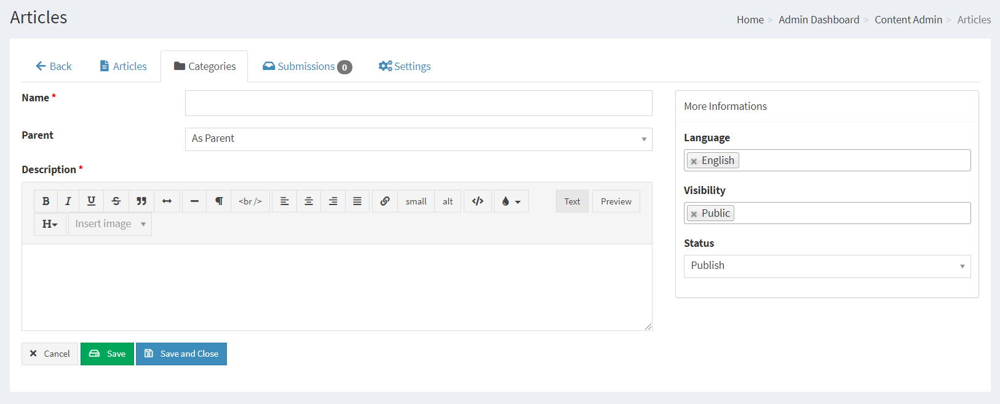
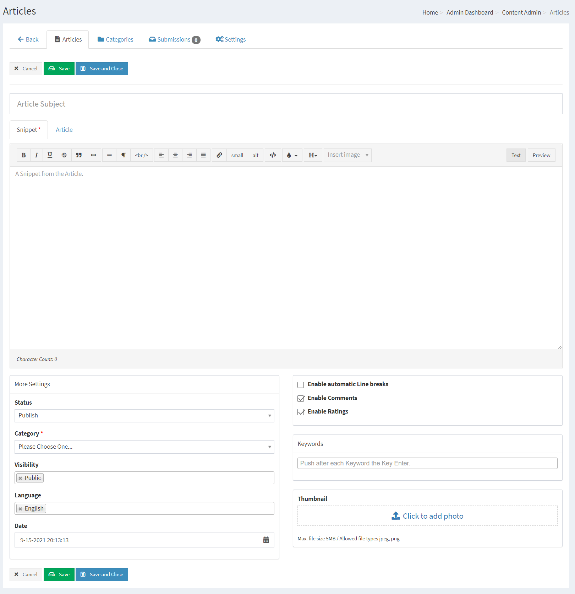
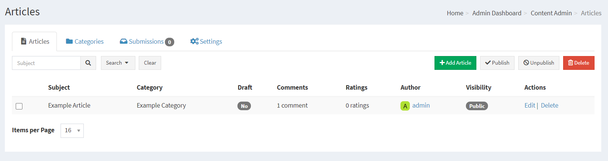
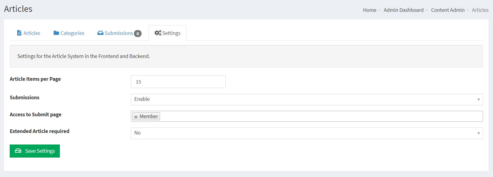
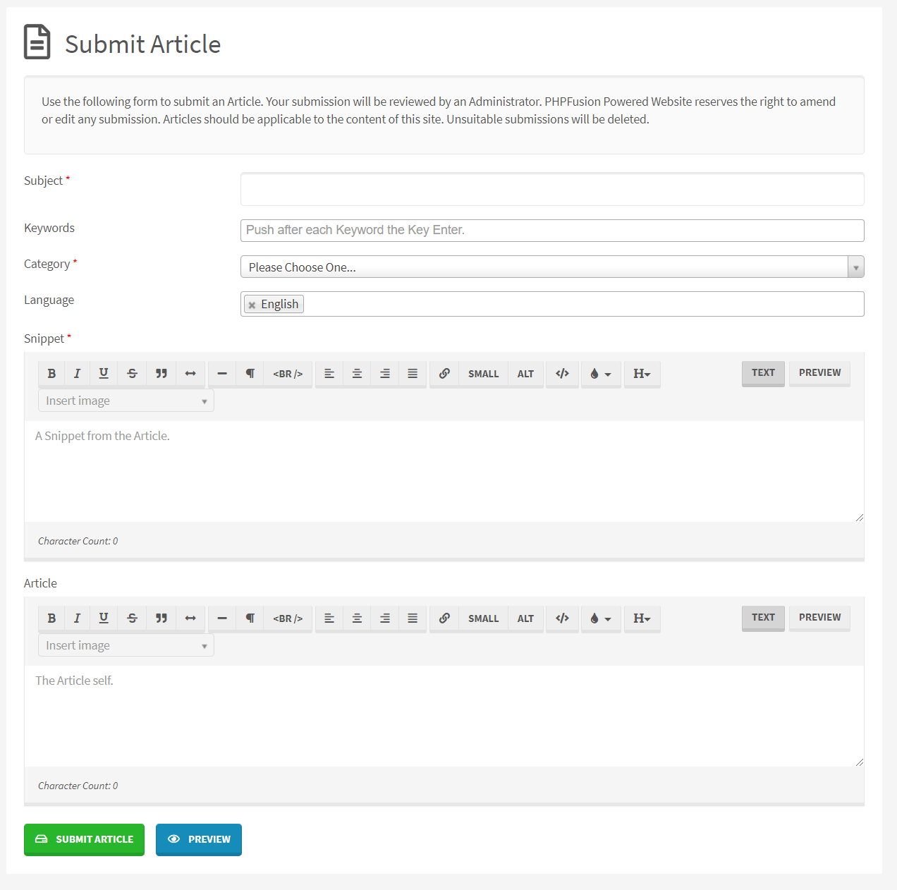
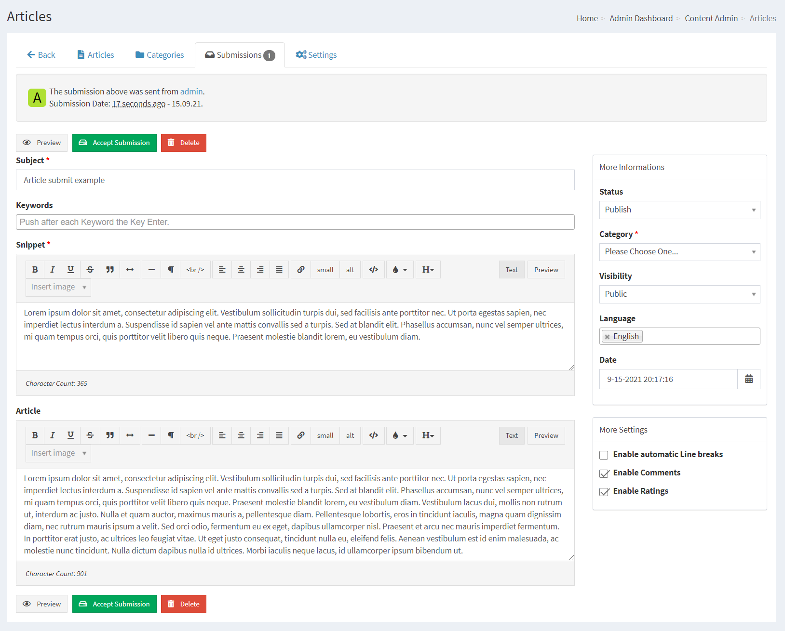

# Articles

Articles system comes with a clean Administration and a Category system that allows you to handle your Articles.

Articles are slightly less complicated than the News system while it is perfect to publish static content.

---

First you need to make sure that you have installed the Infusion we call Articles in your system. This is done from Administration > System Admin > Infusions > Infuse Articles

## Creating Article Categories

Articles Categories must be created before you can add any Articles

Category Name, the title of your Article Category

Category Description, a decription of your Category

Category Parent, As Parent means that you are creating a main category, if you have more categories you can have it as a child to a main category in order to create sub categories.

Language, Select the Language this category will be displayed under (If globally enabled - Settings -> Language Settings). Please see Multilingual Content for more information.

Category Sorting, This selects the default listing order for your Article Categories.

## Adding Articles

Subject: Enter the name of your Article.

Keywords: You can have SEO friendly Keywords defined for each Article, Type your wanted Keyword and press enter for each keyword you want to insert.

Snippet: The snippet will display in the Article Categories list. It can be the first few lines of your Article or a separate introduction. Snippets can also be left blank if you only want the Article names listed. There can be variations in the behavior of this function depending on Theme templates.

Article: The full text for the main body of your Article.

HTML Buttons: The HTML buttons (If TinyMCE is disabled) allow you some minimal formatting for the text of your Article.

Language: This is the language selection from where this Article will be available. Since the Category control this in most scenarios the option is available here for flexibility purposes.

Visibility: Select Access level for this Article.

Save as Draft: Tick this box if you wish to save the Article but not publish it publicly, useful for unfinished Articles or Articles awaiting review.

Automatic Line-Breaks: Will automatically add line breaks to your text.

Enable Comments: Allows members to post comments on the article, (If globally enabled - Settings Miscellaneous).

Enable Ratings: Allows members to rate the article, (If globally enabled - Settings Miscellaneous).

## Current Articles

This is a listing of all your current Articles, you can select one for editing or deletion.

## Articles Settings

There is a basic Settings tab available for the Articles

## Member contribution

Your members can Submit Articles using the internal Submission System.

Reviewing Articles is easy, and you can correct submissions some before publishing or denying.

## SEO / SEF

If your server support mod_rewrite you can enable The Articles SEO Module in Administration -> System Admin -> Permalinks -> Disabled Permalinks.

This will enable your Category and Article titles to act as the links to the content, and it will also make your site very SEO friendly.
