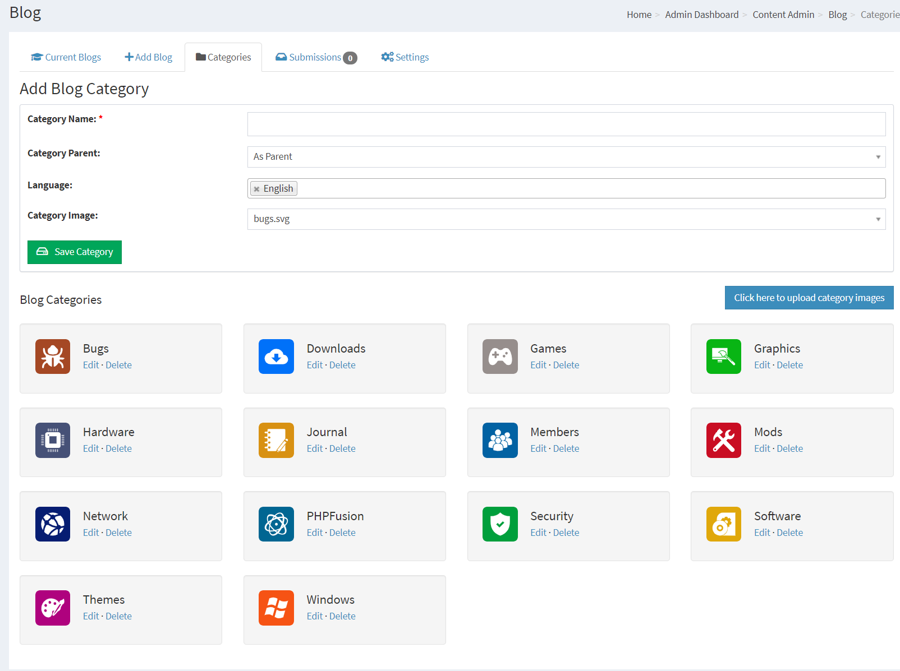
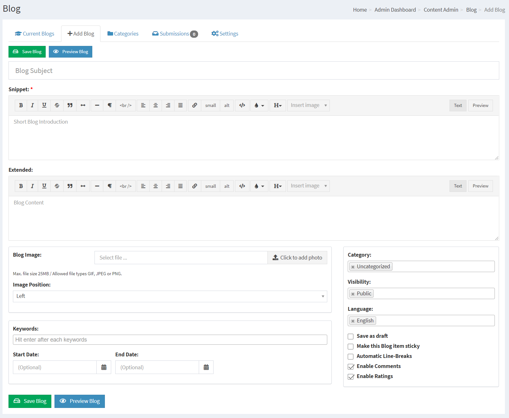
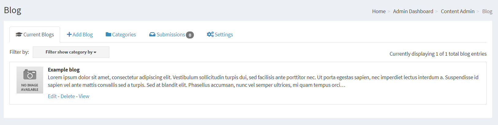
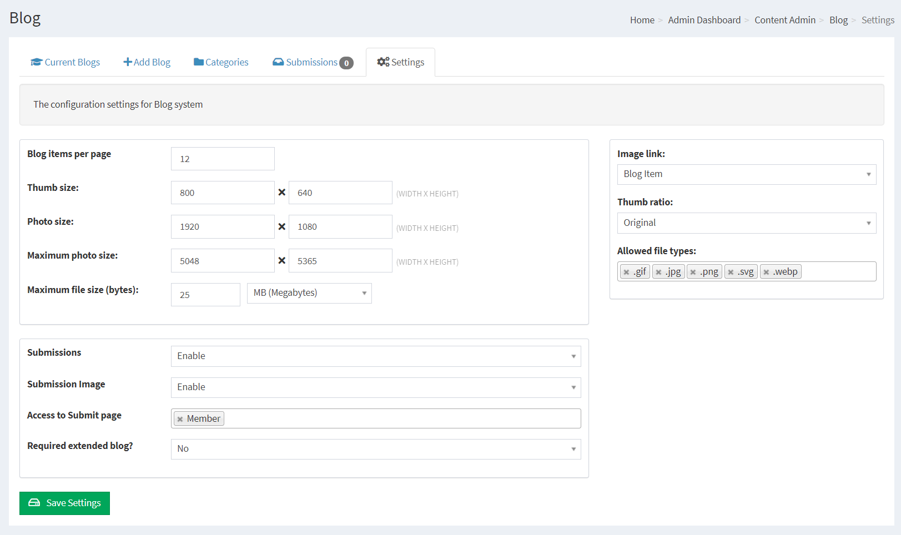
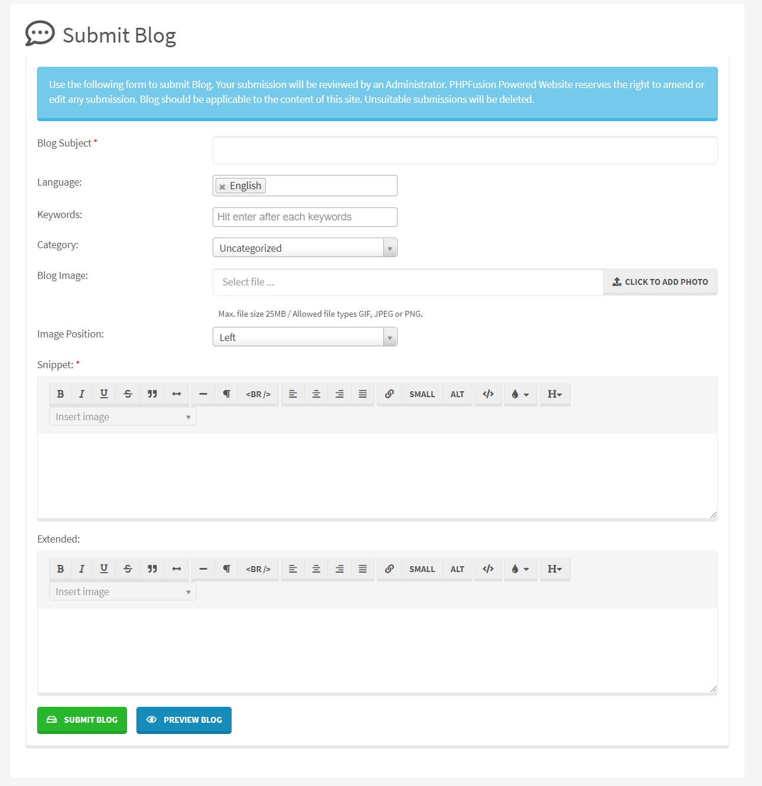
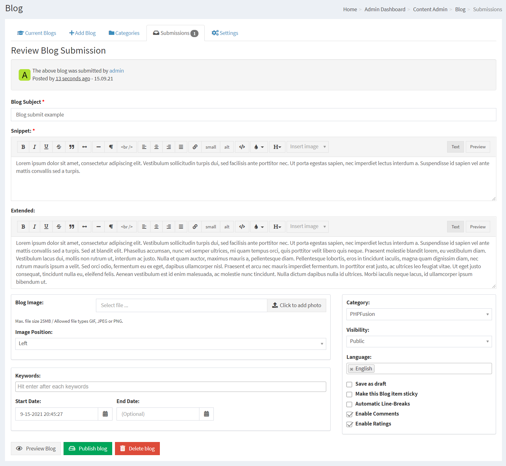

## Blog

Blogs can be pre-entered to the system for automated publishing on pre-defined dates.

You can spend a day to compose a whole week or even years worth of Blogs that will be published automatically for the rest of your pre-defined week or for the rest of the whole year.

The design of the Blog system are determined by the Theme you use, it can be very customized.

---

First you need to make sure that you have installed the Infusion we call Blog in your system.

## Creating Blog Categories

PHPFusion 9 comes pre-loaded with 14 Blog Categories and their respective images for each enabled Language.

Any given Category can be edited or deleted to suit your requirements.

Category Name: Enter Blog Category Name

Category Parent, As Parent means that you are creating a main category, if you have more categories you can have it as a child to a main category in order to create sub categories.

Language: Select the Language this category will be displayed under. (If globally enabled - Settings -> Language Settings). Please see Multilingual Content for more information.

Category Image: Select respective image for that Category.

## Adding Blog

Subject: Enter the Subject of your Blog entry.

Keywords: You can have SEO friendly Keywords defined for each Blog, Type your wanted Keyword and press enter for each keyword you want to insert.

Start Date: You can set an item to appear sometime in the future, leave blank if not needed.

End Date: You can also set an item to be automatically removed from the public view sometime in the future, leave blank if not needed.

Category: If you want the item to appear in a particular category, choose from the list.

With the Blog category system you can add a Blog entry to multiple categories. Repeat the selection for each category you want.

If no category is selected, your Blog will appear in Uncategorized Blog items.

Visibility: Select Access level for this Blog entry.

Language: This is the language selection from where this Blog entry will be available. Please see Multilingual Content for more information.

HTML Buttons: The HTML buttons [If TinyMCE is disabled] allow you some minimal formatting for the text of your Blog item.

Snippet: This is the introduction to your Blog entry, the pull factor if you will. Depending on Theme this is rendered once or twice.

If it repeats in your Theme, it can be a good idea to not have the same text in the extended Blog box.

Extended: If you are posting a larger Blog entry, post the bulk of it here.

Save as Draft: If an item is not finished or not ready for publication, tick the box where it will be marked as [Draft] and will be hidden from view.

Make this Blog item sticky: A Sticky item will remain at the top regardless of posting date.

Automatic Line-Breaks: For large amounts of text, this will place line breaks in your item to break the text up into several pages.

Enable Comments: - Allows members to post comments on the Blog item, [If globally enabled - Settings -> Miscellaneous].

Enable Ratings: - Allows members to rate the Blog item, [If globally enabled - Settings -> Miscellaneous].

## Current Blogs

This is a listing of all your current Blogs, you can select one for editing or deletion.

## Blog Settings

Blog items per page: Number of Blog items to list per page in Categories or on the Blog front page

Thumb size: Default thumb size

Photo size: Default Fullsize

Maximum photo size: Maxium Photo Size allowed

Maximum file size: Maximum file size allowed

Blog Submissions: Enable or Disable to allow user submissions

Submission Image: Enable or Disable to allow user submitted images

Required to be extended Blog: To force both fields to be filled

Image link: Blog Item or Blog Category

Thumb ratio: Original or Square

## Member contribution

Your members can Submit Blogs using the internal Submission System.

Reviewing Blog Submissions is easy, and you can adjust the content of the submissions before publishing or denying.

## SEO / SEF

If your server support mod_rewrite you can enable The Blog SEO Module in Administration -> System Admin -> Permalinks -> Disabled Permalinks.

This will enable your Category and Blog titles to act as the links to the content and it will also make your Blog very SEO friendly.
