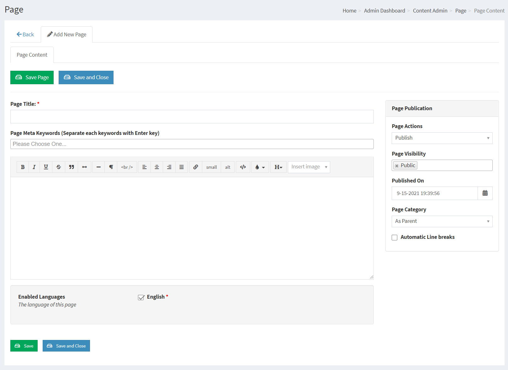
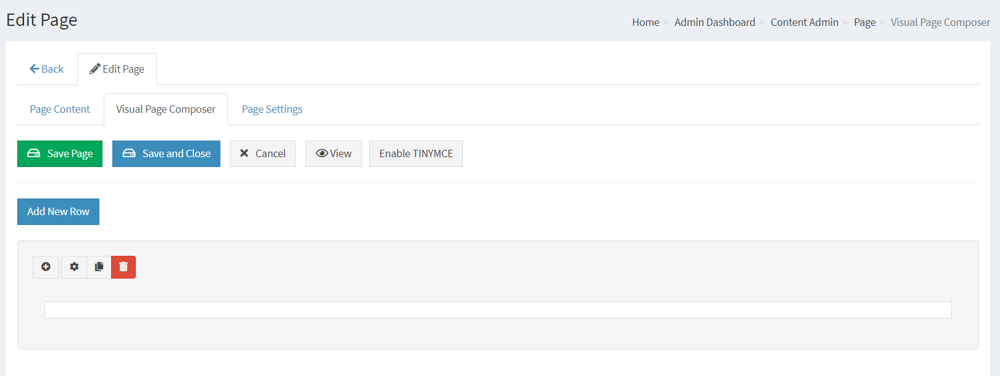
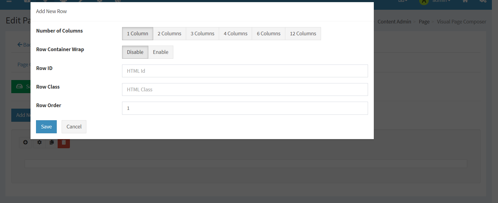
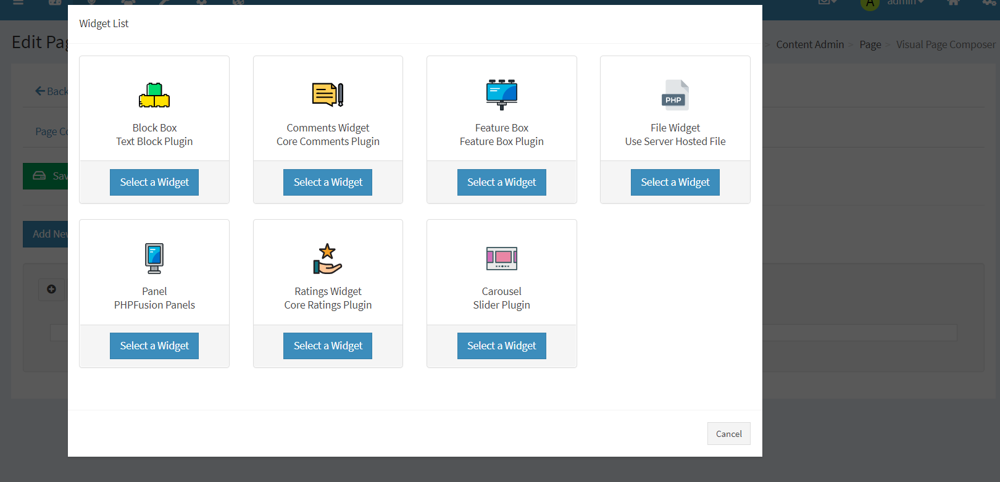
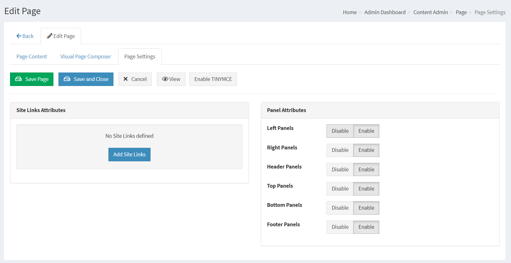
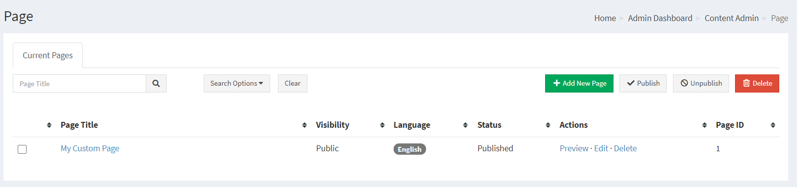

# Custom Pages

A Custom Page is created from the Administration with our Basic formatting editor or with TinyMCE.

Custom Pages can be very powerful when it comes to customizing content to your PHPFusion site.

---

A Custom Page can contain HTML and BBCodes or pure Text.

You can use each Customized Page as a section for your specific content, making your PHPFusion content modularized and easy to edit when necessary with either TinyMCE or a simple textbox.

## Adding a Custom Page

Page Title: Enter name of Custom Page.

Keywords: You can have SEO friendly Keywords defined for each Custom Page, Type your wanted Keyword and press enter for each keyword you want to insert.

Page Content: Your Custom Page content goes here.

If you have TinyMCE Enabled under Administration > Settings > Miscellaneous Settings >TinyMCE Editor , You will be able to see a button to activate it here in the Custom Pages as well.

We have this extra measure as a precaution for site owners who have PHP codes or HTML customizations in various Custom Page sections. If TinyMCE would automatically enable the code´s could be scrambled. This feature gives you a free choice of edit mode for each Custom Page.

## Page Cmoposer

## Page Settings

## Current Custom Pages

This is a dropdown list of all your current Custom Pages with its unique ID before the title, you can select one for viewing, editing or deletion.

To Manually create Custom Page links you can look at the ID in the current Pages and insert it with viewpage.php, for example viewpage.php?page_id=1 < The Page ID.

## SEO / SEF

If your server support mod_rewrite you can enable The Custom Pages SEO Module in Administration -> System Admin -> Permalinks -> Disabled Permalinks.

This will enable your Custom Page titles to act as the links to the content, and it will also make your site very SEO friendly.
