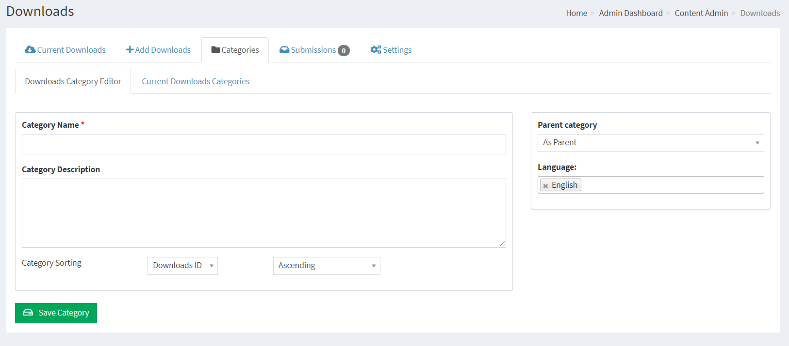
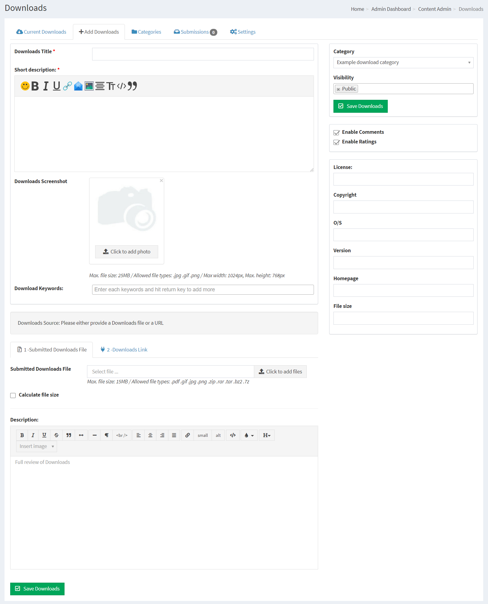
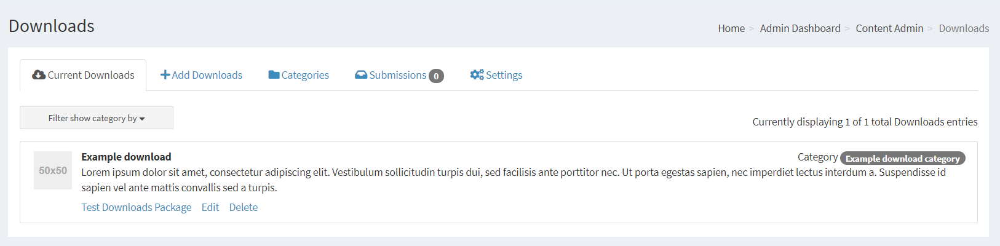
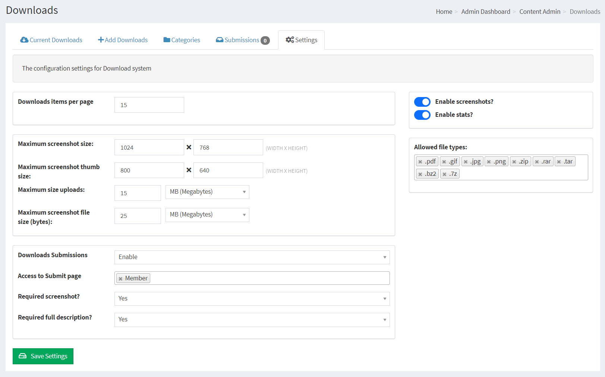
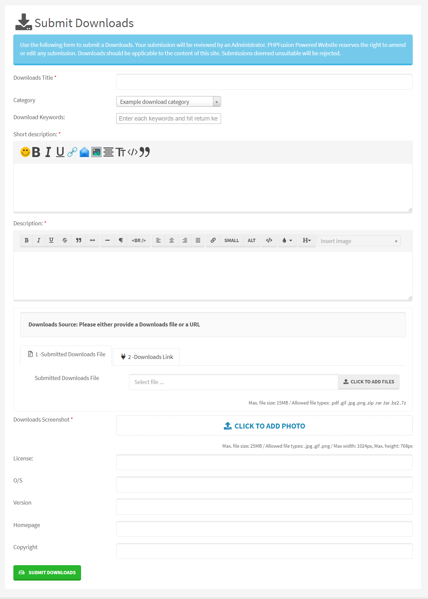
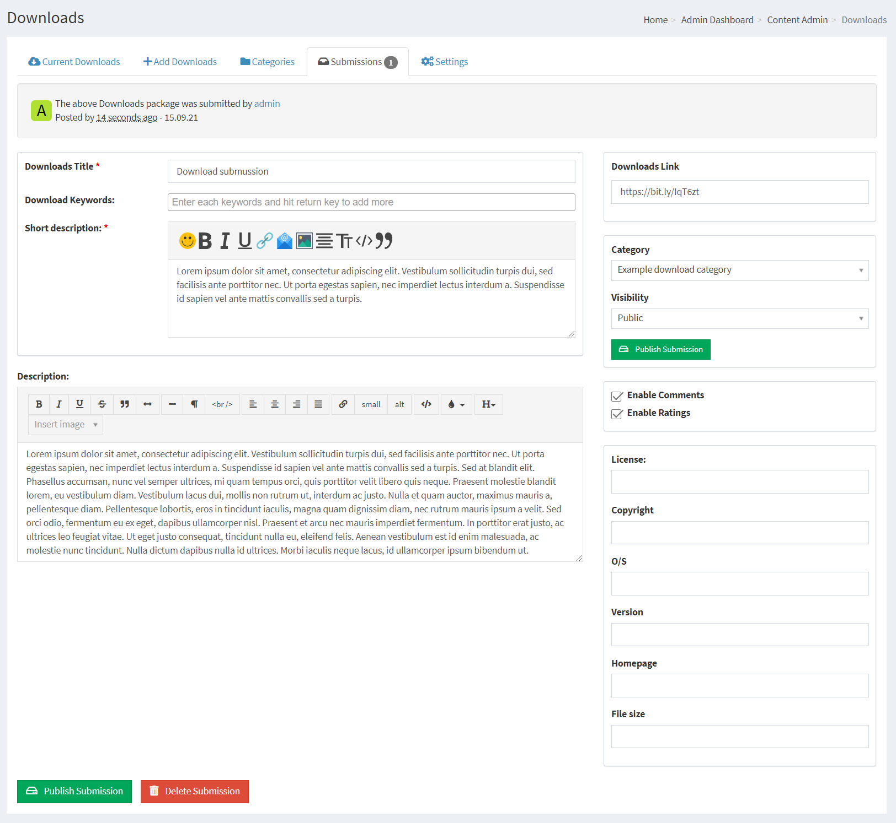

# Downloads

You can add Download Categories and you can upload a file or link to an external URL for Download.

Downloads system includes a Download counter which shows you how many times any given item has been Downloaded.

---

First you need to make sure that you have installed the Infusion we call Downloads in your system.

This is done from Administration > System Admin > Infusions > Infuse Downloads

## Creating Download Categories

Download Categories must be created before you can add any Downloads

The categories can be edited later even if there are Downloads in that category.

Category Name, the title of your Download Category

Category Description, a decription of your Category

Category Parent, As Parent means that you are creating a main category, if you have more categories you can have it as a child to a main category in order to create sub categories.

Language: Select the Language this category will be displayed under. [If globally enabled - Settings -> Language Settings]. Please see Multilingual Content for more information.

Category Sorting, This selects the default listing order for your Download Categories.

## Adding Downloads

Downloads Title: Enter the title of your Download.

Short description: The short description will display in the Downloads Categories list. It can be the first few lines of your Download or a separate introduction. There can be variations in the behavior of this function depending on Theme templates.

Keywords: You can have SEO friendly Keywords defined for each Download, Type your wanted Keyword and press enter for each keyword you want to insert.

Submitted Downloads File: Attach a file for your download

URL: If already uploaded to your site or if you have a remote host, you can enter the path to the file to be Downloaded, eg; /Downloads/my_file.zip or a URL.

Calculate file size: Tick this box if you want the system to calculate the Download file size for you.

Description: A full description to your download.

Visibility: Select Access level for this Download.

Downloads Screenshot: Attach a screenshot to your Download.

Enable Comments - Allows members to post comments to the Download, [If globally enabled - Settings Miscellaneous].

Enable Ratings - Allows members to rate the Download, [If globally enabled - Settings Miscellaneous].

License: If applicable, enter the Download license.

Copyright: If applicable, Display who owns the Copyrights

O/S: If applicable, enter in Operating System that your download is compatible with.

Version: If applicable, enter Download version number.

Homepage: If applicable, enter Download Homepage.

Filesize: If you did not tick the Calculate file size or if your server have issues with the feature, type it manually here.

## Current Downloads

This is a listing of all your current Downloads, you can select one for editing or deletion.

## Download Settings

There is a Settings tab available for the Downloads

Download items per page: Number of Download items to list per page in Categories or on the Downloads front page

Maximum screenshot size: Default Fullsize

Maximum screenshot thumb size: Default thumb Size

Maximum size uploads: Maximum file size allowed uploading

Maximum screenshot file size: Maximum file size allowed for screenshot uploads

Download Submissions: Enable or Disable to allow user submissions

Required screenshot?: Force user submitted images attached to the Downloads

Required full description?: Force full descriptions of the Downloads

Enable Screenshots?: Allow or Disallow screenshots globally.

Allowed file types: Decide what type of files you will allow to the system.

## Member contribution

Your members can Submit Downloads using the internal Submission System.

Reviewing Download Submissions is easy, and you can correct submissions some before publishing or denying.

## SEO / SEF

If your server support mod_rewrite you can enable The Downloads SEO Module in Administration -> System Admin -> Permalinks -> Disabled Permalinks.

This will enable your Category and Download titles to act as the links to the content, and it will also make your site very SEO friendly.
