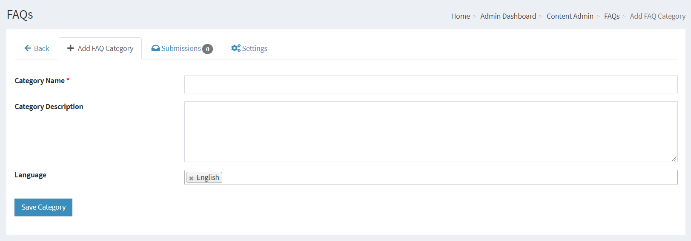
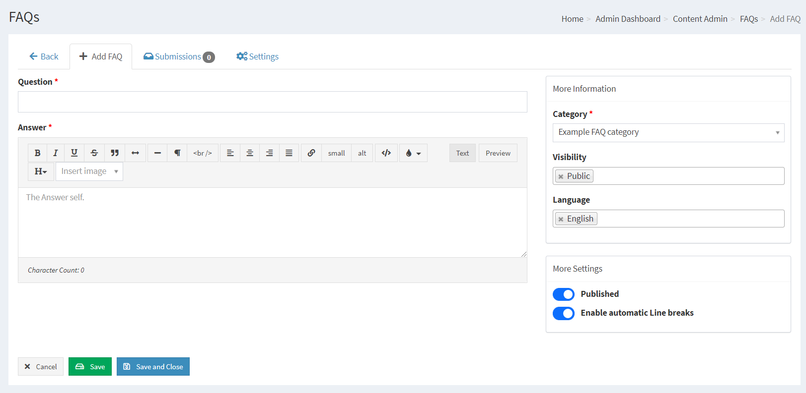
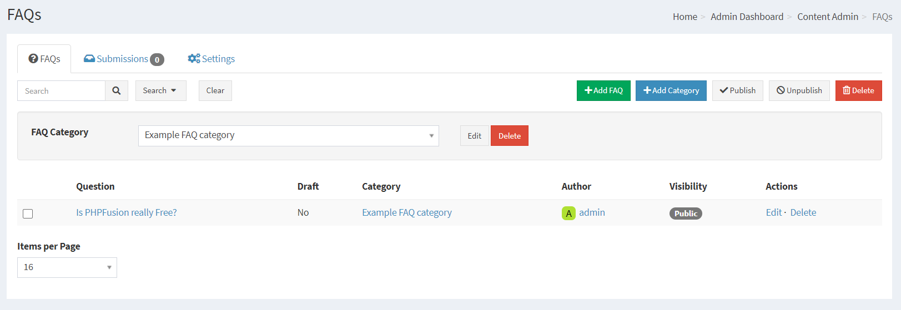
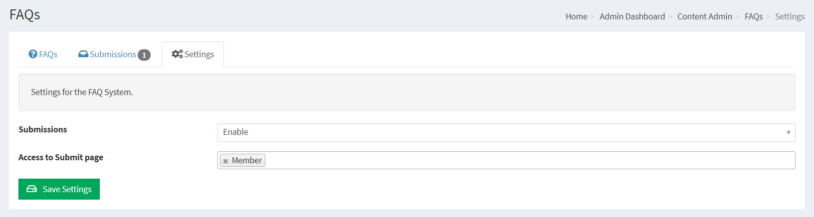
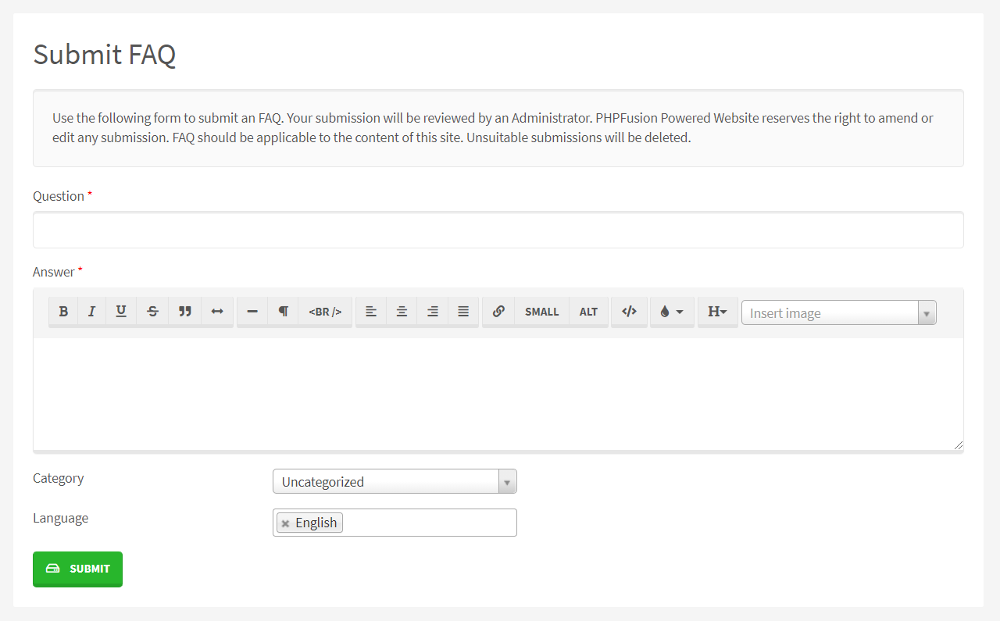
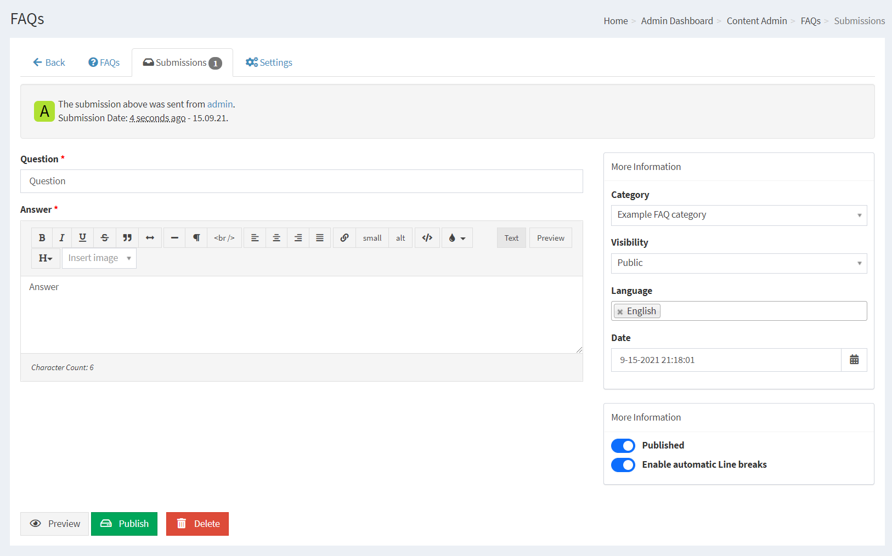

# FAQ

FAQ is short for Frequently Asked Questions.

PHPFusions FAQ system contains an easy to understand Catageory creator for any type of Questions and Answers topics.

---

First you need to make sure that you have installed the Infusion we call FAQ in your system.

This is done from Administration > System Admin > Infusions > Infuse FAQs

## Creating FAQ Categories

FAQ Categories must be created before you can add any Questions and Answers.

These categories can be edited later even if there are content in that category.

Category Name: Your FAQ Topic

Category Description: Description of the Topic

Language: This is the language selection from where this category will be available. Please see Multilingual Content for more information.

Category Name, the title of your Article Category

Category Description, a decription of your Category

Category Parent, As Parent means that you are creating a main category, if you have more categories you can have it as a child to a main category in order to create sub categories.

Language, Select the Language this category will be displayed under (If globally enabled - Settings -> Language Settings). Please see Multilingual Content for more information.

Category Sorting, This selects the default listing order for your Article Categories.

## Adding FAQs

Question: Enter your common question.

Answer: Enter the answer to the question, You can add some basic formattings to these answers.

Category: Select the Category.

## Current FaQs

You can edit or delete your current FAQs and their respective category from here.

The default listing is your category with a questions count.

Once you click on the category name you will be able to see the questions and the options to these.

## FAQ Settings

There is a basic Settings tab available for the FAQ.

## Member contribution

Your members can Submit FAQ using the internal Submission System.

Reviewing FAQ is easy, and you can correct submissions some before publishing or denying.

## SEO / SEF

If your server support mod_rewrite you can enable The FAQ SEO Module in Administration -> System Admin -> Permalinks -> Disabled Permalinks.

This will enable your FAQ Categories to act as the links to the content, and it will also make your FAQ very SEO friendly.
