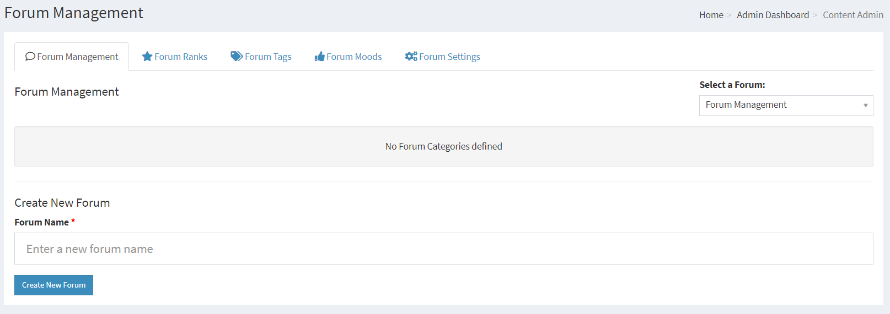
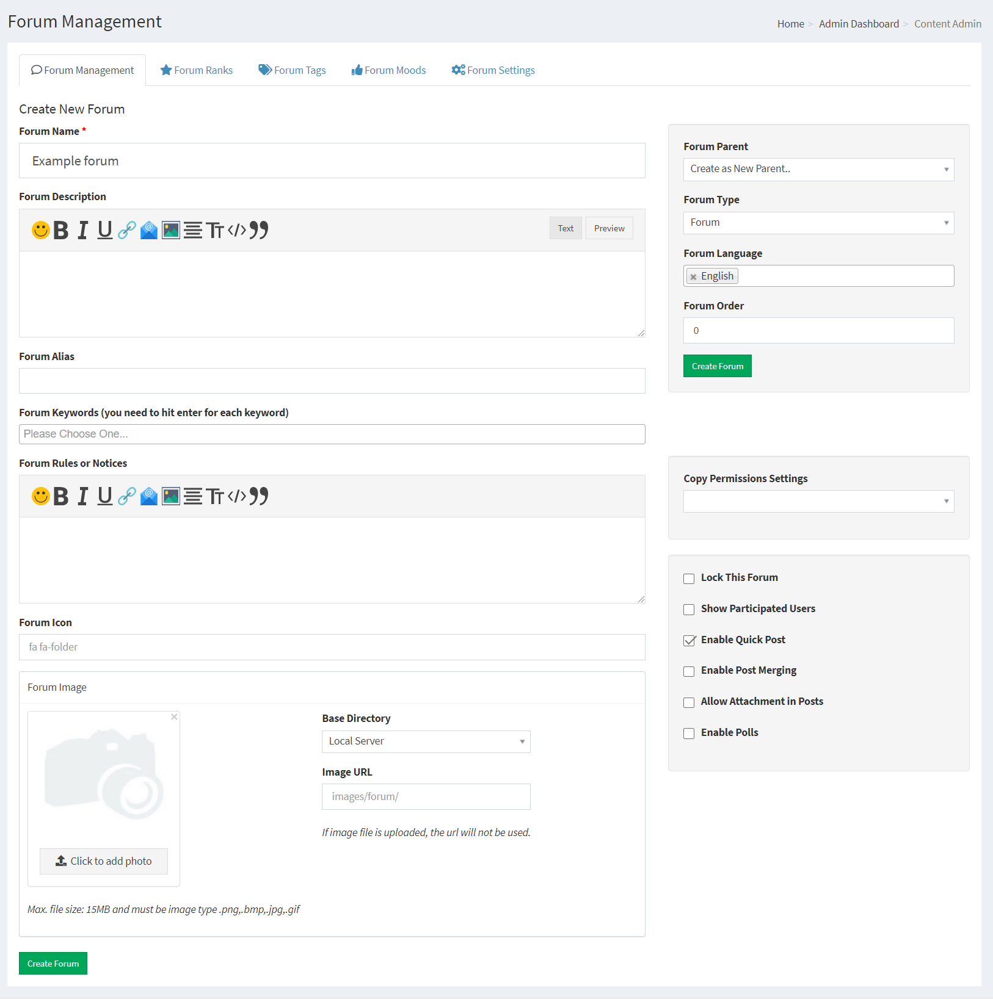
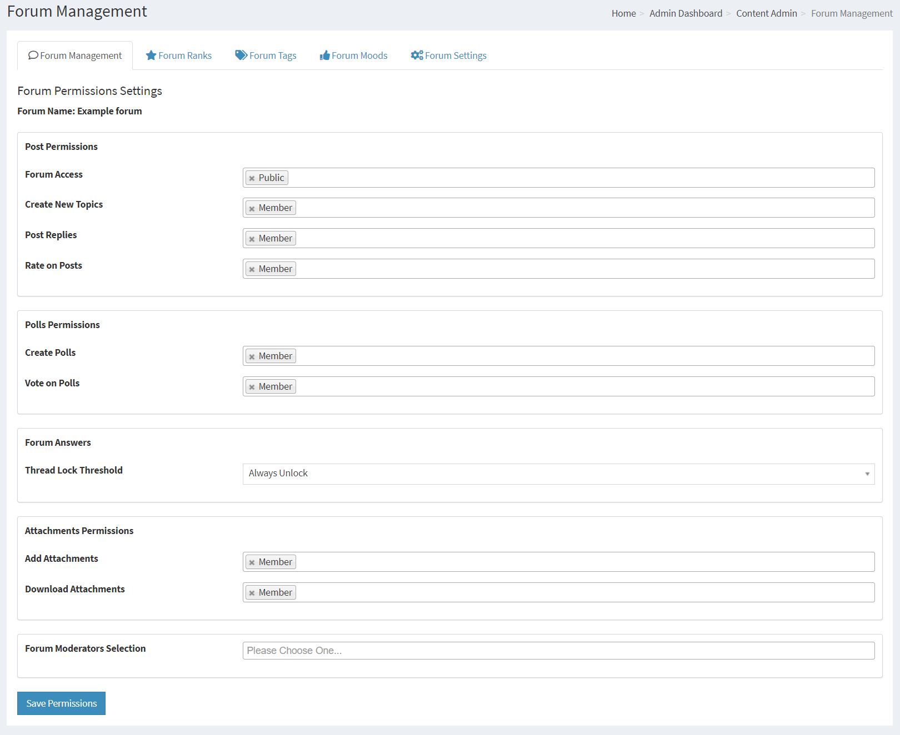
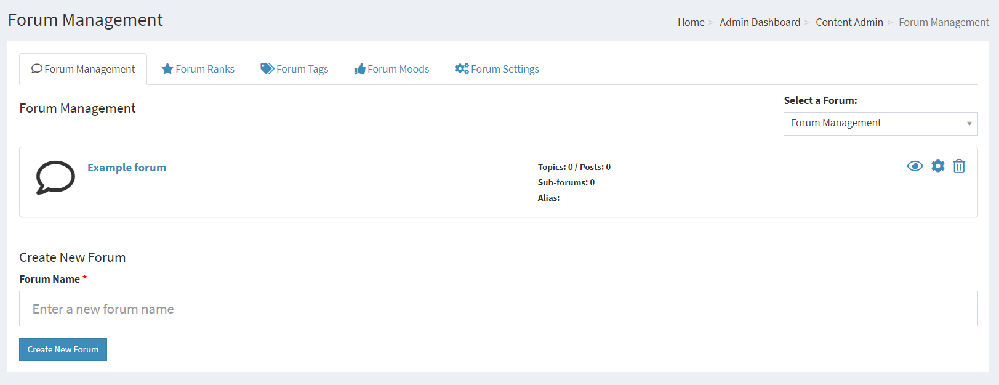
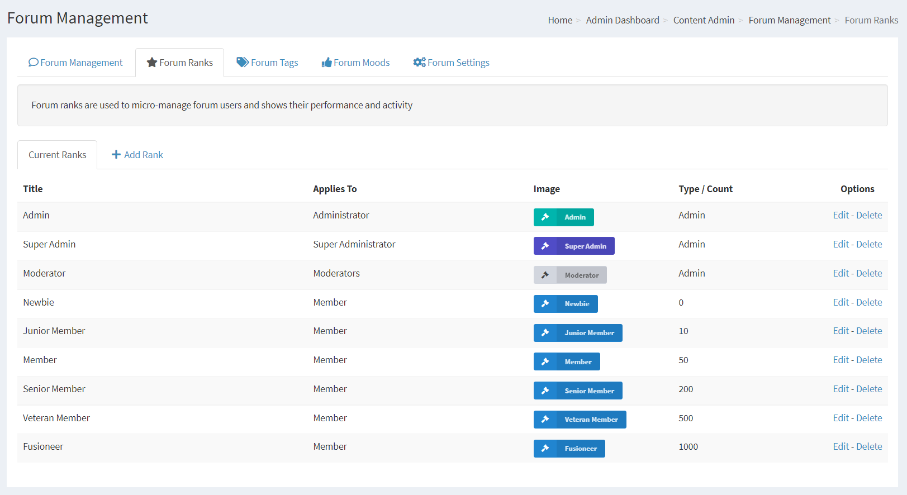
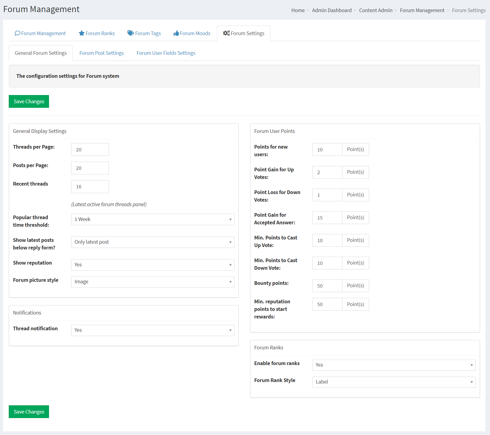
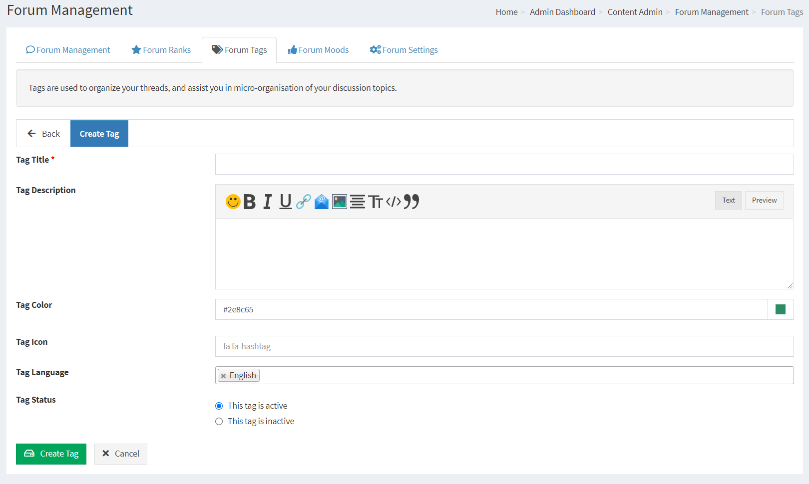
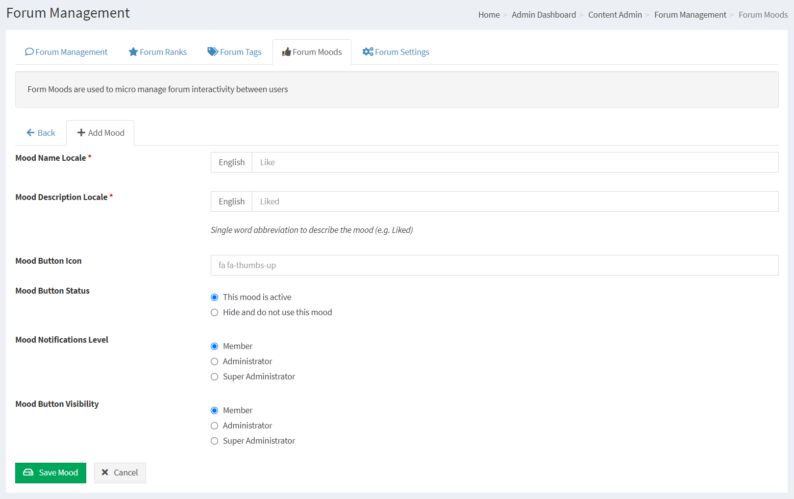

# Forum

The Forum system can provide you with a rock solid Forum that is ready to be customized for your needs.

You can have a functional Forum up and running with one Main Forum category by the help of a few mouse clicks.

You can assign Moderators with Access levels either on a User level or set by the native User Group functions of PHPFusion.

You can have as many or as few Forums or your site as you like.

---

First you need to make sure that you have installed the Infusion we call Forum in your system.

This is done from Administration > System Admin > Infusions > Infuse Forum

## Creating Forums

Forums are required before you can add any Threads with topics.

The Forum creation is done in 3 steps,

**Step 1**

Enter the Forum name

**Step 2**

Configure your Forum

Forum Description: A suitable description for your Forum category.

Forum Alias: We support Forum Aliases

Forum Keywords: SEO friendly Keywords are enabled for each Forum category created.

Image Upload / Image URL: You can upload an image or provide a URL to a Forum image.

Forum Rules or Notices: Each created Forum can have it´s rules specified on top.

Forum Parent: Create as New Parent is the default. This means that you are creating a Main forum category. If you have other Main forum categories created you can select your new Forum as a child to one of these. Thus making Forum sub categories.

Forum Language: This is the language selection from where this Forum category will be available. Please see Multilingual Content for more information.

Forum Order: Forum Categories are listed, this determines the order of your Forum categories. You will also be able to change this order in real time with arrows on the Forum Management page once you have a few Forums created.

Copy Permission Settings: If you have other Forums with a base set of settings, this is a shortcut to get them to your new Forum.

Lock This Forum : You can have the forum locked from public entries.

Show Participated Users : Displays a small list of users participated.

Enable Quick Post : Enabled a small Quick Post box at the end of all posts.

Enable Post Merging : Enabled the post merger. If a user does multiple posts after each other they will be merged.

Allow Attachment in Posts : Allow file attachments in the Forum.

Enable Polls : Enable the Forum Polls system in the Forum.

**Step 3**

When you click create Forum you will come to the final step, Forum Permissions.

Post Permissions

Forum Access : Default is Public

Create New Topics : Default is Member

Post Replies : Default is Member

Rate on Posts : Default is Member

Polls Permissions

Create Polls : Default is Member

Vote on Polls : Default is Member

Forum Answers

Thread Lock Treshold : Always unlock

Attachments Permissions

Add Attachments : Default is Member

Download Attachments : Default is Member

Forum Moderators Selection

Click in the field to select one or several user groups from your current user groups.

When Clicking on the Save Permissions you will be directed back to the Forum Index.

You can sort your Forums with the help of the arrows here.

You can quickly edit permissions by clicking on the key icon.

You can quickly edit the Forum by clicking the cog icon.

You can delete the forum by clicking the x icon.

## Forum Ranks

You can set your own rank names for your Forums depending on number of posts.

Moderators, Administrators and Super Administrators have set ranks which are not affected by post count.

Forum Ranks must be enabled in Administration -> Settings -> Forum Settings -> Enable forum ranks

**Add Rank**

Rank Title: Enter the Rank title

Rank Image: Select the image to correspond with the Rank

Language: This is the language selection from where this Rank will be available. Please see Multilingual Content for more information. It is possible to make the Ranks global for all your installed Languages.

Rank Posts Set the number of posts required for the Rank to be achieved

Apply to: Select the user level this Rank applies to.

## Forum Settings

Recent threads : This is a setting for the included Latest Active Forum Threads Panel

Threads per Page : Number of threads to list per page. A Forum can contain many threads. In these threads you also have posts.
Posts per Page : Number of posts to list per page. A Forum can contain many threads. In these threads you also have posts.
Thread notification : Allow users to subscribe on threads or not.

Time limit for editing : Select amount of minutes in the droplist. A user can not edit their posts when the time set has passed since it was created. (In minutes, 0 for no limit)
Show IP Publicly : If you want to display all members IP in public
Enable forum ranks : Toggle the Forum Ranks feature
Forum Rank Style : You can select between Image or Label.
Show lastpost avatar : Display the avatar or not of the last post in the forum listings.
Lock Edit : Lock forum during post edits or not.
Update time on edit : Refresh the post time after an edit or not.

Attachments max size : In selected format. (b,kb,mb)
Attachments max count : Select amount of attachments to allow for each new post made.
Allowed file types : Select what file types you should allow to be attached.

Popular thread time threshold : How long should a popular thread be able to count as a popular thread before it is automatically excluded for the rank.
Show the latest posts below reply form : This will display a list of the latest posts below the reply form if enabled.
Recount Users Posts : This button will make a recount of each user's posts and update their stats for it.

## Tags

## Moods

## SEO / SEF

If your server support mod_rewrite you can enable The Forum SEO Module in Administration -> System Admin -> Permalinks -> Disabled Permalinks.

This will enable your Threads and Posts to act as the links to the content, and it will also make your Forum very SEO friendly.
