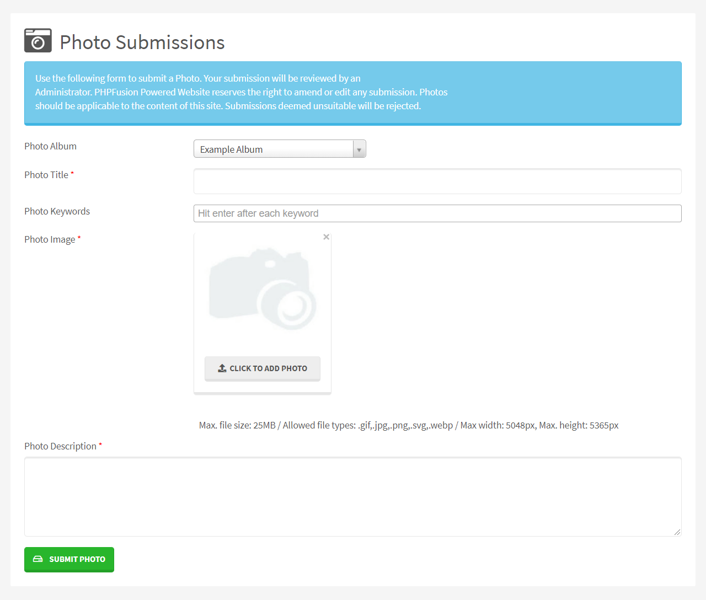

# Gallery

PHPFusion 9 have a Gallery system that we maintain for the public.

You can create and maintain Photo Albums very easy with the help of our Gallery system.

The design of the Gallery system are determined by the Theme you use, it can be very customized.

---

First you need to make sure that you have installed the Infusion we call Gallery in your system.

## Add Album(s)

Album Title: Enter the Album name

Keywords: You can have SEO friendly Keywords defined for each Album, Type your wanted Keyword and press enter for each keyword you want to insert.

Description: A brief description, optional.

Album Thumbnail: Upload a thumbnail photo for this Photo Album.

Visibility: Select Access level for this Album.

Language: This is the language selection from where this category will be available. Please see Multilingual Content for more information.

Order: For multiple albums, use this to set the order in which they are displayed.

## Current Albums

With Album Actions you are able to move the order of an Album, Delete an Album or Edit a selected Album.

Use the tab Add Photo in order to populate an Album with Photos.

To view, manage and to populate a Photo Album with photos, you can click either the Album or click the Album name once it has at least one Photo in it.

## Add Photo > Single Photo Upload

Photo Title: Enter the Photo name.

Keywords: You can have SEO friendly Keywords defined for each Album, Type your wanted Keyword and press enter for each keyword you want to insert.

Photo Order: For multiple photos, use this to set the order in which they are displayed in your current Photo Album.

Photo Image:: Browse on your local computer for the photo you want to upload.

Description: A brief description, optional.

Photo Album: The Album you want to place your Photo in.

Enable Comments: - Allows members to post comments on the Photo item, [If globally enabled - Settings -> Miscellaneous].

Enable Ratings: - Allows members to rate the Photo item, [If globally enabled - Settings -> Miscellaneous].

## Add Photo > Mass Photo Upload

You can batch upload up to 20 photos at a time here. We have it set to 20 because of timeout reason on many hosts. Click +Add Photo, hold and drag multiple images to select the images box.

You can also select more than one photo to upload by holding the key [SHIFT] or [CTRL] while clicking.

Comments and Ratings are on by default.

Photo title will have the file name and descriptions will be left empty on mass uploads.

Click Upload Selected Photos to start uploading your photos.

## Gallery Settings

Thumbs per page: Number of items to list per page in Albums and on the Gallery front page

Thumbnail size: Default thumb size

Photo size: Default Photosize when viewing Photos

Photo max. size: Maxium Photo Size allowed

Photo max. file size: Maximum file size allowed

Allow photo submissions: Enable or Disable to allow user submissions

Require photo description: To force a photo description on user submission

Enable photos watermark: Enable for photos to have a watermark stamp

Enable text description on photos: Untick to not have description field for Photos

Save generated watermarks: It will save your watermarks

Specify .png image watermark: Path to your watermark image

Album title watermark color: Select Album title color for watermark

Album description watermark color: Select description color for watermark

Photo title watermark color: Select Photo title color for watermark

You can delete existing watermarks here as well.

## Member contribution

Your members can Submit Photos using the internal Submission System.

Reviewing Photo submissions is easy, and you can adjust the content of the submissions before publishing or denying.

## SEO / SEF

If your server support mod_rewrite you can enable The Photo Albums SEO Module in Administration -> System Admin -> Permalinks -> Disabled Permalinks.

This will enable your Album titles and Photo titles to act as the links to the content and it will also make your Gallery very SEO friendly.
