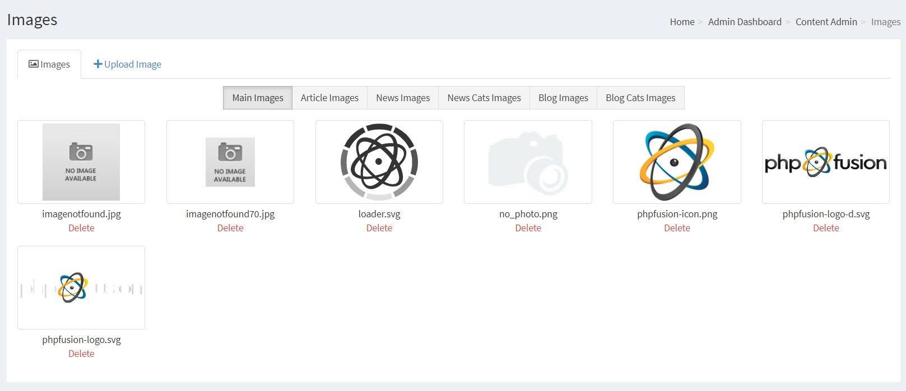
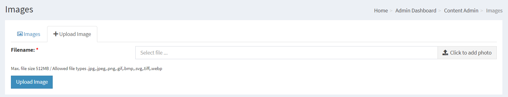

# Images

You can manage images for your site using the native image handler.

---

## List of images

Main Images: This folder would contain general images you use in one or more places around your site. These images are located in images folder.

The other pre-defined destinations are Article Images, News Images, News Cat Images, Blog Images and Blog Cat Images,
each of which are specifically for Articles, News and Blog images.

You can select to add more images, delete images or view images.

## Uploading

First select one of the pre-defined folders, you will have options to upload, view image or delete images that exist in these folders.

When uploading an image use the browse button to navigate to the required image on your PC and then click the "Upload Image" button.

