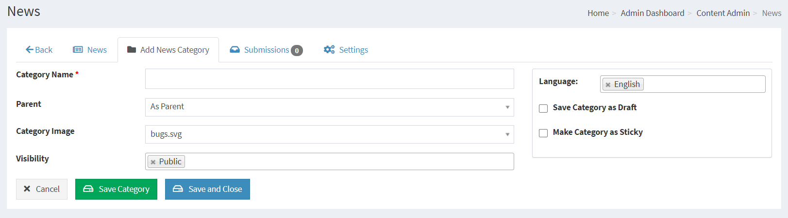
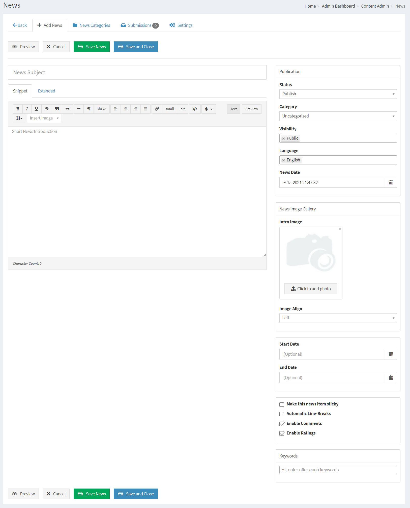
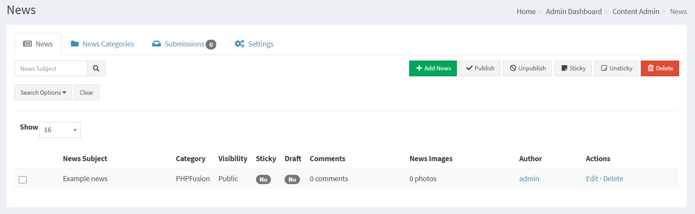
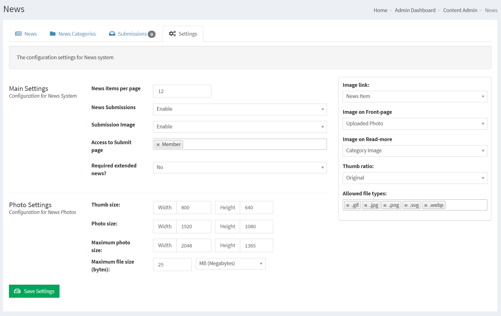
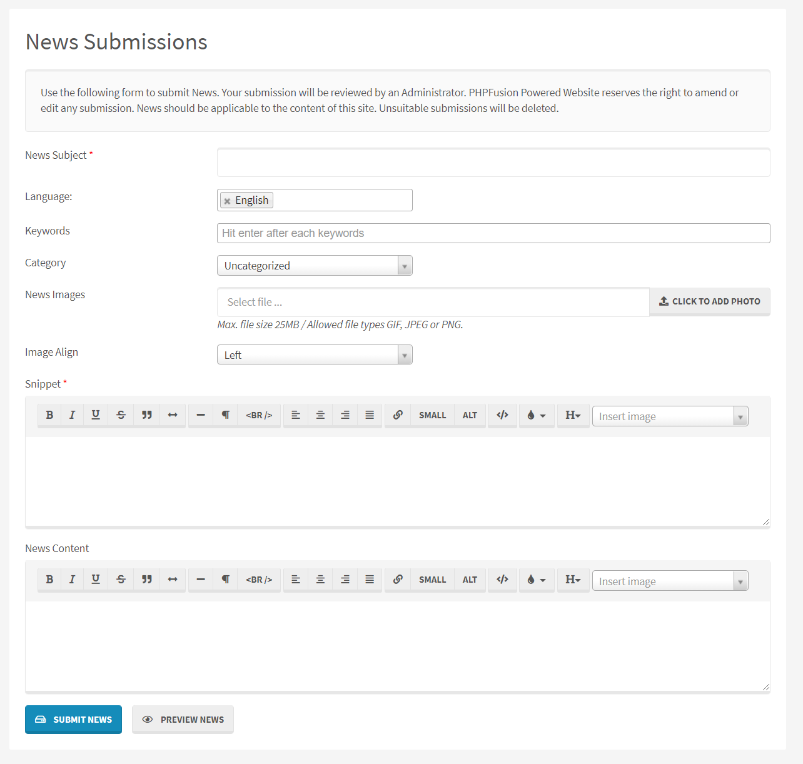
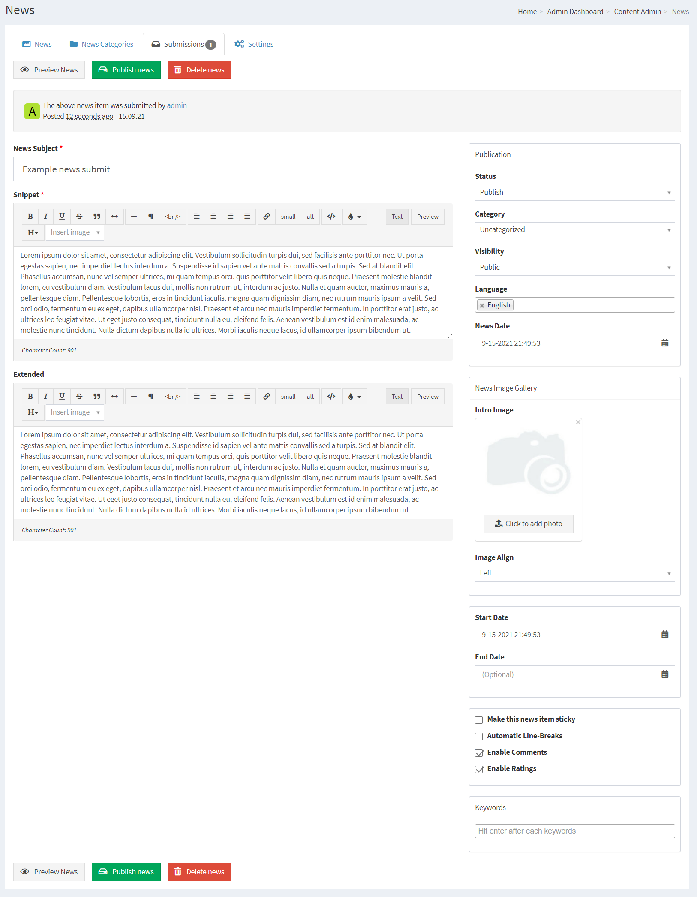

# News

News can be pre-entered to the system for automated publishing on pre-defined dates.

You can spend a day to compose a whole week or even years worth of News that will be published automatically for the rest of your pre-defined week or for the rest of the whole year.

The design of the News system are determined by the Theme you use, it can be very customized.

---

First you need to make sure that you have installed the Infusion we call News in your system.

## Creating News Categories

Articles Categories must be created before you can add any Articles

Category Name: Enter News Category Name

Category Parent, As Parent means that you are creating a main category, if you have more categories you can have it as a child to a main category in order to create sub categories.

Language: Select the Language this category will be displayed under. [If globally enabled - Settings -> Language Settings]. Please see Multilingual Content for more information.

Category Image: Select respective image for that Category. [ See News Category Images ]

PHPFusion 9 comes pre-loaded with 16 News Categories and their respective images for each enabled Language.

Any given Category can be edited or deleted to suit your requirements.

## Adding News

Subject: Enter the Subject of your News entry.

Keywords: You can have SEO friendly Keywords defined for each News, Type your wanted Keyword and press enter for each keyword you want to insert.

Start Date: You can set an item to appear sometime in the future, leave blank if not needed.

End Date: You can also set an item to be automatically removed from the public view sometime in the future, leave blank if not needed.

Category: If you want the item to appear in a particular category, choose from the list.

If no category is selected, your News will appear in Uncategorized.

Visibility: Select Access level for this News entry.

Language: This is the language selection from where this News entry will be available. Please see Multilingual Content for more information.

HTML Buttons: The HTML buttons [If TinyMCE is disabled] allow you some minimal formatting for the text of your News item.

Snippet: This is the introduction to your News entry, the pull factor if you will. Depending on Theme this is rendered once or twice.

If it repeats in your Theme, it can be a good idea to not have the same text in the extended News box.

Extended: If you are posting a larger News entry, post the bulk of it here.

Save as Draft: If an item is not finished or not ready for publication, tick the box where it will be marked as [Draft] and will be hidden from view.

Make this News item sticky: A Sticky item will remain at the top regardless of posting date.

Automatic Line-Breaks: For large amounts of text, this will place line breaks in your item to break the text up into several pages.

Enable Comments: - Allows members to post comments on the News item, [If globally enabled - Settings -> Miscellaneous].

Enable Ratings: - Allows members to rate the News item, [If globally enabled - Settings -> Miscellaneous].

## Current News

This is a listing of all your current News In each respective Category, you can select one for editing or deletion.

## News Settings

News items per page: Number of News items to list per page in Categories or on the News front page

Thumb size: Default thumb size

Photo size: Default Fullsize

Maximum photo size: Maxium Photo Size allowed

Maximum file size: Maximum file size allowed

News Submissions: Enable or Disable to allow user submissions

Submission Image: Enable or Disable to allow user submitted images

Required extended News? To force both fields to be filled

Image link: News Item or News Category

Image on Front-page: Uploaded Photo or Category Image

Image on Read-more: Category Image or Uploaded Photo

Thumb ratio: Original or Square

## Member contribution

Your members can Submit News using the internal Submission System.

Reviewing News Submissions is easy, and you can adjust the content of the submissions before publishing or denying.

## SEO / SEF

If your server support mod_rewrite you can enable The News SEO Module in Administration -> System Admin -> Permalinks -> Disabled Permalinks.

This will enable your Category and News titles to act as the links to the content, and it will also make your News very SEO friendly.
