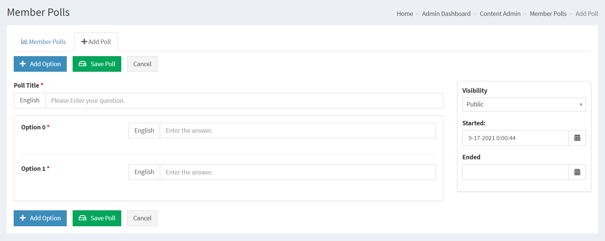
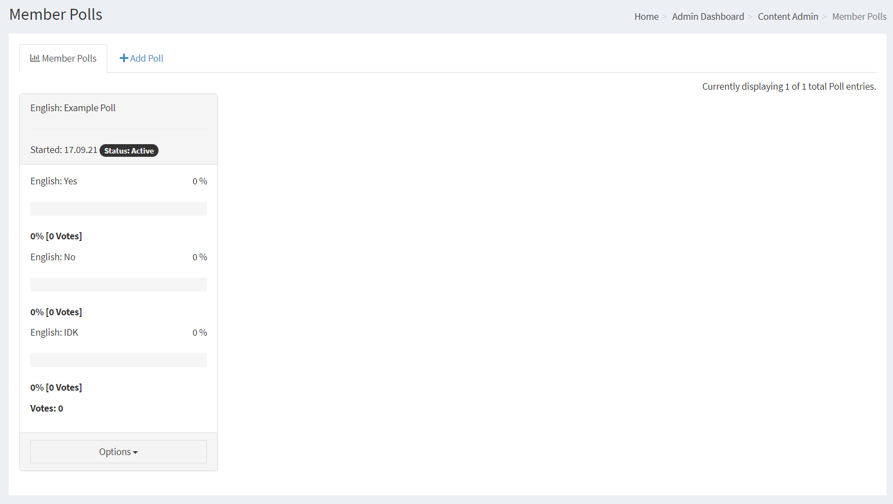

## Polls

You can set Polls for your members to vote on any topic you like.

---

First you need to make sure that you have installed the Infusion we call Polls in your system.

## Adding Polls

Poll Title: Enter your Poll topic, e.g.; What do think of my site?

Language: This is the language selection from where this Poll will be available. Please see Multilingual Content for more information.

Option (xx) All Polls need to have a minimum of two options.

You can increment the options by clicking the Add Option button.

In the options you can enter the options' member have to choose from, e.g.

1, I love PHPFusion

2, It's OK

and so on to a maximum of 10 options.

A member will not be able to view the results from others voting until after they have voted.

The full results of the previous poll are then displayed in Polls Archive.

You can only have one Poll active, if you create a new Poll the current one will automatically close.

## Current Polls

You can edit polls from the droplist.

By editing a current Poll and ticking the box Close this Poll, a poll will end and users will not be able to vote on it.

Members Poll panel must be Added and Enabled in Panels Management for started Polls to be visual.

This is automatically done when installing the Poll system.

Access levels is set on a Panel level for this system.
