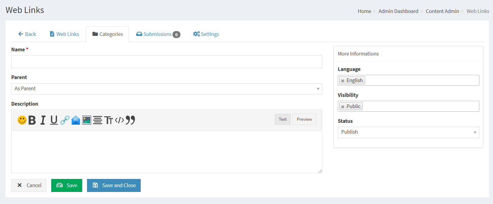
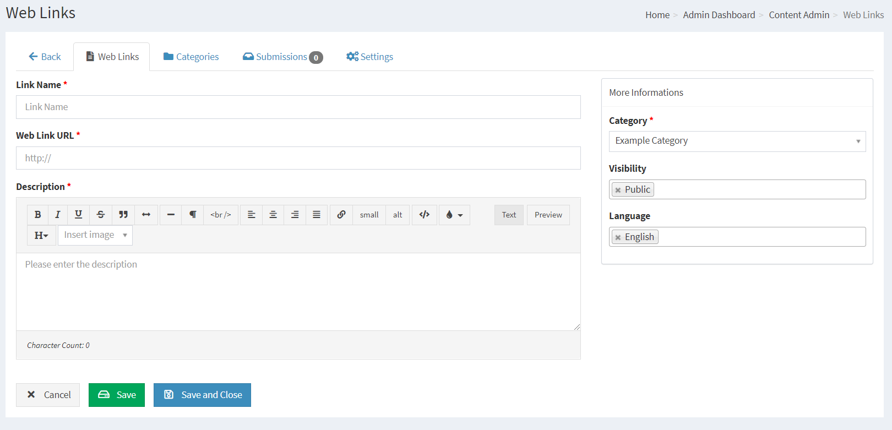
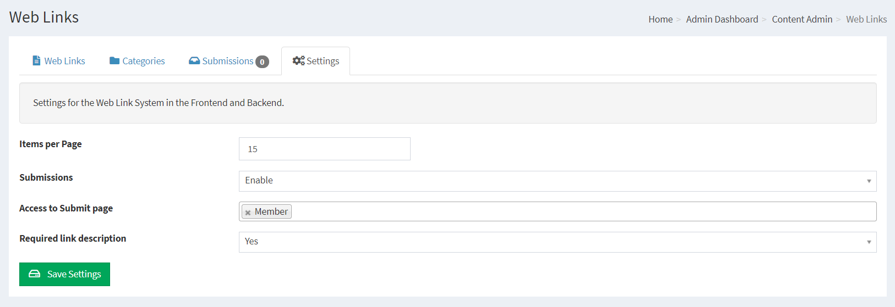
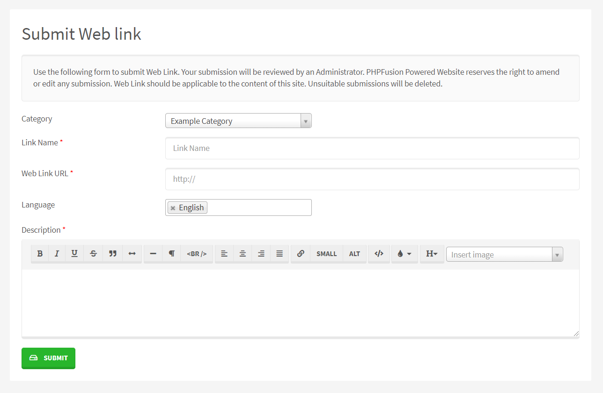
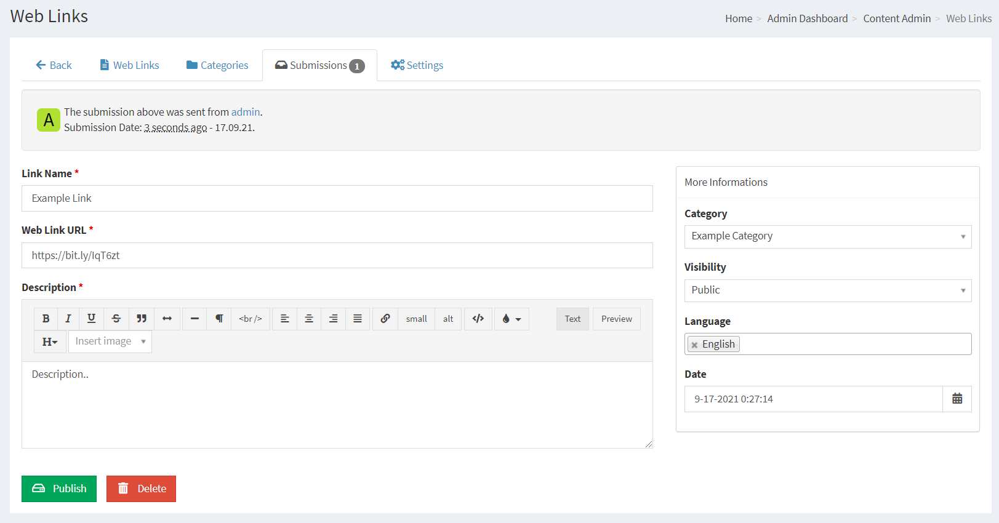

# Web Links

Web Links system contains a link Category creator and an Administration to add Web Links with a suitable title.

Web Links are a collection of website addresses that the site owner or site members think may be interesting or of value to others.

---

First you need to make sure that you have installed the Infusion we call Web links in your system.

## Creating Web Link Categories

Before Web Links can be added, Web Link Categories need to be created.

Category Name: Enter Category name.

Category Description: A brief description, if desired.

Parent Category: As Parent means that you are creating a main category, if you have more categories you can have it as a child to a main category in order to create sub categories.

Language: This is the language selection from where this category will be available. Please see Multilingual Content for more information.

Category Sorting: Set how the Categories will be listed.

## Adding Web Links

Web Link Name: Enter the title for this Web Link

Web Link URL: Enter full site URL, it is good to include http://. All clicked Web Links will open in new browser window.

Description: A brief description or a few lines from the site itself, if desired.

Category: Choose which category the link goes into.

Visibility: Select Access level for this Web Link

## Web Link Settings

Links per page: Enter the amount of Web Links, Web Link categories to list per page

Allow Web Link submissions: Enable or Disable to allow user submissions

Require Web Link description: Force or do not force descriptions to the Web Links

## Member contribution

Your members can Submit Web Links using the internal submission system if it is enabled in the Web Link Settings.

Reviewing Web Link submissions is easy, and you can adjust the content of the submissions before publishing or denying.

## SEO / SEF

If your server support mod_rewrite you can enable The Web Links SEO Module in Administration -> System Admin -> Permalinks -> Disabled Permalinks.

This will enable your Category and Web Link titles to act as the links to the content, and it will also make your Web Links very SEO friendly.
