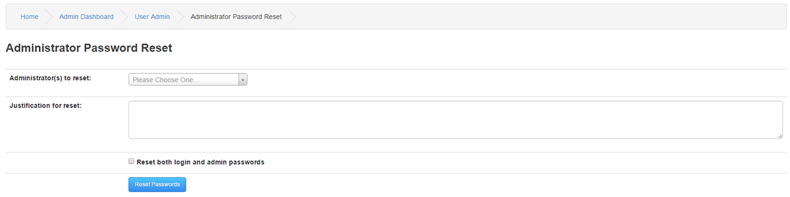
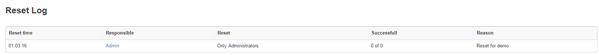

# Administrator Password Reset

The Admin Password Reset tool will allow you to reset Administrators passwords with a given reason.

---

Administrator(s) to reset: All Administrators, Only Super Administrators, Only Administrators, Or an individual Administrator of your choice.

Justification for reset: Write the reason for this reset.

Reset both Login and Admin passwords option will let you do a complete reset on all passwords.

## Reset Log

The Reset log will display historical resets with the reasons given.

As an extra security precaution all Administrators passwords can be routinely reset and the reason logged.
Each affected Administrator will receive an e-mail with their new Login details.
