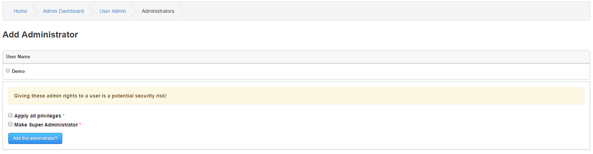

# Administrators

---

This is where you add Administrators to your site, you assign rights to them so that they can access certain, or all, parts of the Administration and specific Infusions.

You can promote any member you want to the position of Administrator.
Administrators have increased access, especially in Forums where they automatically have full moderator access.

You can set which parts of the Administration section that they can have access to.
Choose carefully, it is a good idea only to allow an Administrator access to sections that they would need to carry out their duties.
You should try to minimize the number of people who have full access for security reasons.
Administrators elevated to Super Administrator level have full access to all sections.

## Add Administrator

If you want to promote one of your members to Administrator, enter either their username or user id in the search form field and click search.

Tick the button beside the member you want to make Administrator, choose whether to give them full access, if not you can go back later and edit the settings to give access to whichever sections you want.
You can also choose to make the member a Super Administrator.

## Edit Administrators
To edit an Administrator, just click Edit beside the name on the Admin front page listing.
You will then see a list of all sections of the site.

Tick the boxes of the sections you want to allow access,and then click Save Admin Rights when done.

Some areas are more security related than others, so only give access for these areas to people you trust. E.g.; Custom Pages, Panels, Database Backup.
