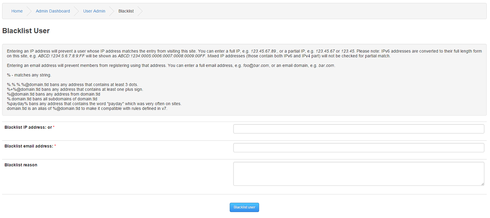
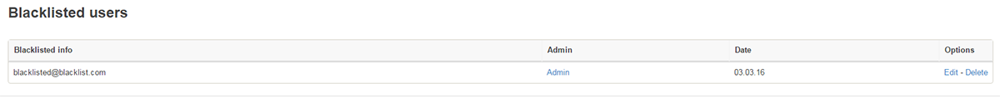

# Blacklist

The Blacklist is a list of all email addresses or domains and IP addresses you want to prevent from accessing your site.

---

You can Blacklist with Wildcards.

Entering an IP address will prevent a user whose IP address matches the entry from visiting this site. You can enter a full IP, e.g. 123.45.67.89., or a partial IP, e.g. 123.45.67 or 123.45. Please note: IPv6 addresses are converted to their full length form on this site, e.g. ABCD:1234:5:6:7:8:9:FF will be shown as ABCD:1234:0005:0006:0007:0008:0009:00FF. Mixed IP addresses (those contain both IPv6 and IPv4 part) will not be checked for partial match.

Entering an email address will prevent members from registering using that address. You can enter a full email address, e.g. foo@bar.com, or an email domain, e.g. bar.com.

% - matches any string.

%.%.%.%@domain.tld bans any address that contains at least 3 dots.

%+%@domain.tld bans any address that contains at least one plus sign.

%@domain.tld bans any address from domain.tld

%.domain.tld bans all subdomains of domain.tld

%payday% bans any address that contains the word "payday" which was very often on sites.

domain.tld is an alias of %@domain.tld to make it compatible with rules defined in v7.

Blacklist IP address: Enter the IP address you wish to block.

Blacklist email address Enter the email address [spammer@spamcity.com] or even the full domain if required [spamcity.com]

Blacklist Reason For reference you can add a reason to each blacklist entry.

This is list of all blacklists you've entered. Use the edit link if you want to change any details of a particular record.
