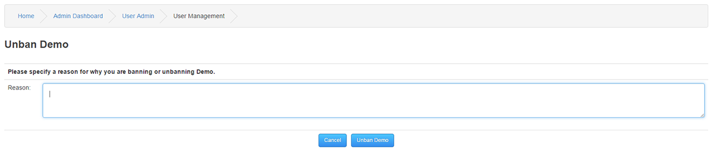

# Members

Administrate the members on your site.

---

You can view, edit, suspend, anonymize, cancel, ban or delete any members [user level 101] using this page.
You can view the member list using the dropdown to view whichever member status you want.

Options

Ban: This will prevent a member from logging in to the site permanently.

Security: Ban This is automatically done from flood control.

Suspend: This will prevent a member from logging in to the site for a specified length of time

Cancelled: Users can request their membership to be deleted.

Anonymize: Same as Cancelled, but posted information remains visible but username changed to Anonymous

Delete Member: This will remove the member and all Core data connected to the member such as Forum posts, Comments, Private Messages, Polls, Ratings.

## Add New Member

Use the Add Member link to manually enter a new member, you will need their email address for this. Once saved a confirmation mail will be sent to the new member added with their login details.

Once logged in, the new member can edit their password and other settings in edit profile.

## Edit Member

You can alter a members preferences

## Suspending Members

You can suspend a member from your site with any amount of days you desire.
Each suspension will be logged for the member in question.

## Lifting Suspensions

You can lift a suspension from previously suspended members at any time.
Use the droplist to sort by Suspended and click reinstate on your wanted member.

Once you have clicked the Reinstate button you should see the screen were you can specify reason before lifting the suspension.

## Baning Members

To Ban a member click on the Down arrow next to the Delete button and Select Ban.

Specify a reason for why you are banning this member and click Ban [User Name]

## Lifting Bans

You can lift a Ban from previously Banned members at any time.
Use the top right view droplist to sort by Banned and click reinstate on your wanted member.

Once you have clicked the Reinstate button you should see the screen were you can specify reason before lifting the Ban.

