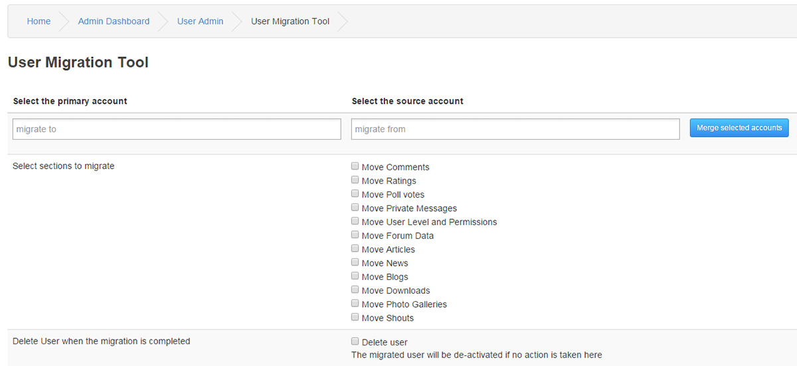

# Migration Tool

The User Migration Tool will merge one or more user accounts with all Core component data attached to a selected primary account.

---

Select the primary account

This is the target account.

Select the source account

This is the account you move the data from.

Select sections to migrate

Tick the checkbox for content you want to transfer.
Only Infused Core components will be visual in this list.

Delete User when the migration is completed

Tick Delete user box if you want to delete the source user when the migration is completed.
If you do not take any action the migrated user will be de-activated automatically.
