# User Fields

---

View and manage the User Fields on your site.

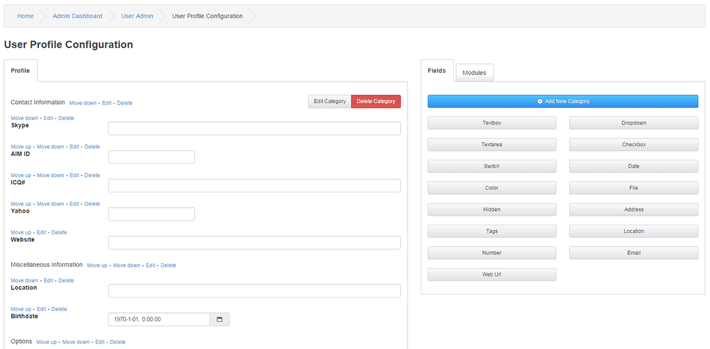

Profile

This is the default category that displays a list of all enabled User Fields in this category.
You can click on Move Down and Move Up to arrange the order of these fields.
The fields will be listed in the user profiles as they are listed here.
To change preferences on a field you can click edit

## Adding Categories

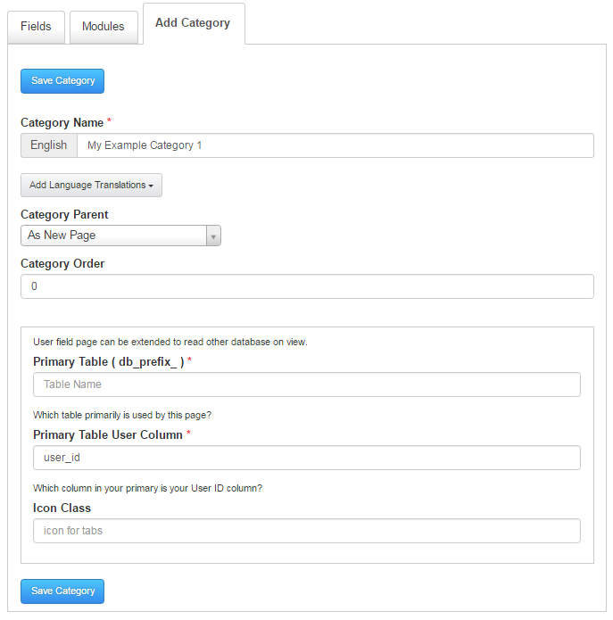

When creating categories you will get new tabs for the profile.

Category Name, This is the name of your new category in the default language.

Add Language Translations, You can add a direct tab translation for each installed language you have.

Category Parent, You can select as New Page or in an already created category as a subsection.

Category Order, The order of your listing.

Primary Table ( db_prefix_ ) *, Default is already set so there is no need to fill this unless you connect to 3d party table.

Which table primarily is used by this page?

Primary Table User Column *, If you are using standard User Field Modules user_id is the default, and you need to type user_id in to the field before saving. Make sure you read the readme for custom User Fields that can have different connections.

Icon Class, Class if you want entypo or font-awesome icons in the tab.

Result of the created Category

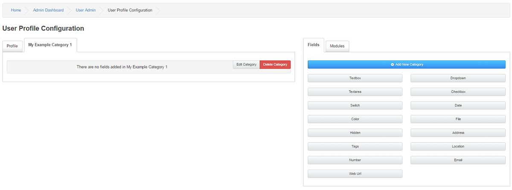

Populating a new Category

Before you can Add Modules to your new category a Heading / Subcategory is required.
Click on Add New Category again, Write the name of your desired heading and select your newly created tab in the category list, click Save Category.

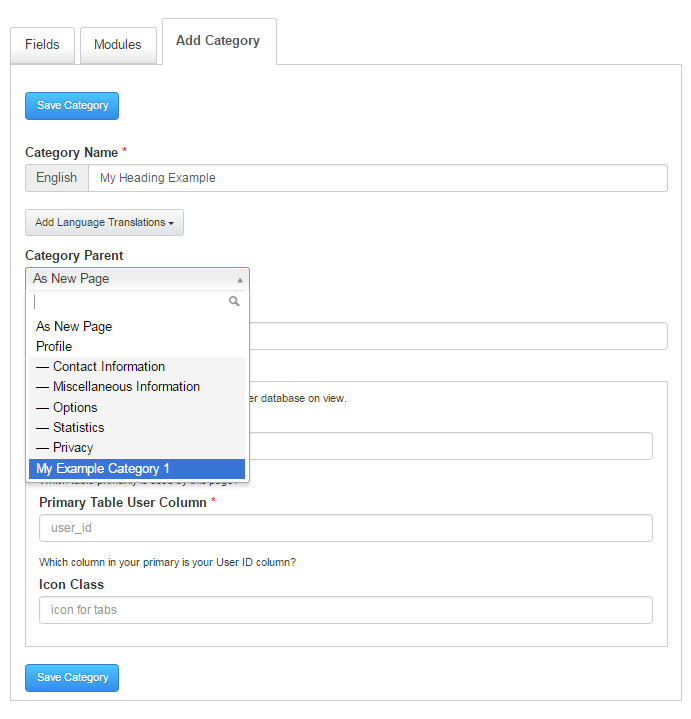

At this point you will be able to see and view your new tab with the heading.

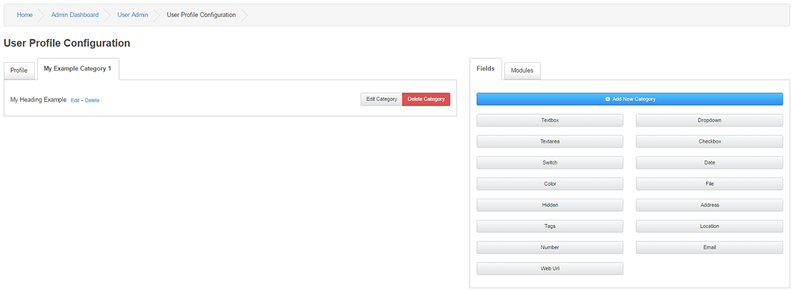

## Adding Field Modules

There are several options and methods when it comes to adding User Fields

1, Core User Fields

2, Customized Personal User Fields with the help of our editor

3, Community create User Fields

## Core User Fields

These are the Fields most people will find good use of on a Standard installation.
Click on the tab Modules.
You will see a list of non-installed User Fields here.

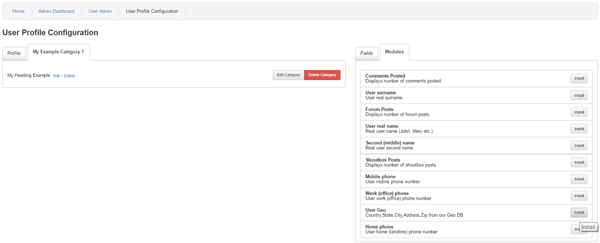

In this example, the User Geo field will be installed to our new tab.
GeoMap is a Country > State selector + City and two address fields with 250 Countries and 6832 States covered.

Click Install on your desired User Field.
First an information table is displayed,

Module Fields Information

Version: 1.02.00

Field Table Column:

user_geo

Field Table Column Info:

VARCHAR(200) NOT NULL DEFAULT ''

Field Description:

Country,State,City,Address,Zip from our Geo DB

Right below you will see a set of options,

Select Category : Connected to User Field Categories, you can select where this User Field belongs. ( We will select My Heading Example )

This is a required field : Tick this to force the users to fill out this field.

Log User Fields : Tick this to log the user action in the User Log.

Attach Field to Register Form? Tick this to display this User Field during site registration.

Order : Select the order of the field

Once completed, click Install Field

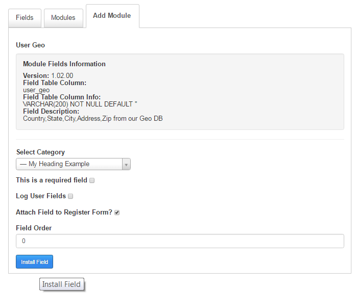

The result is an installed User Geo Field in the new Category.

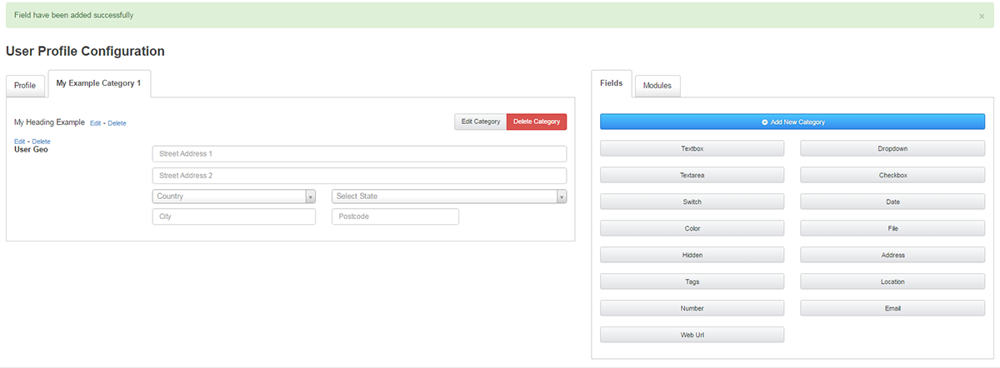

User can edit their Profile´s and the new category is present

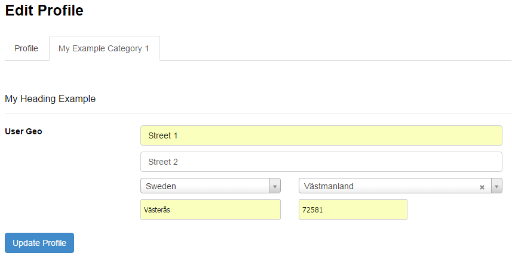

Users visiting the Profile will be able to see the results

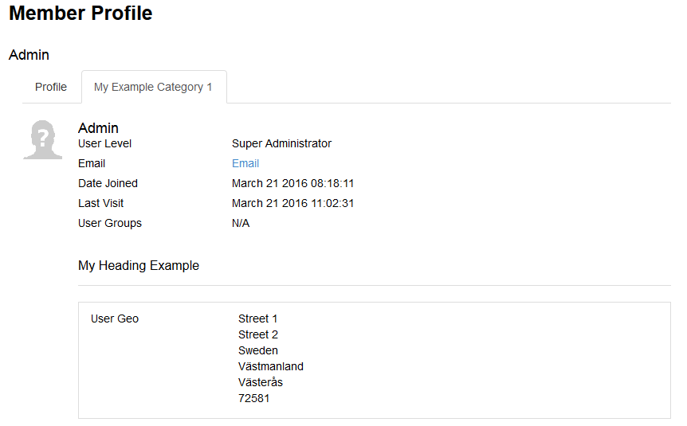

## Customized Personal User Fields with the help of our editor

In this example a Textfield will be added, Click on Textbox

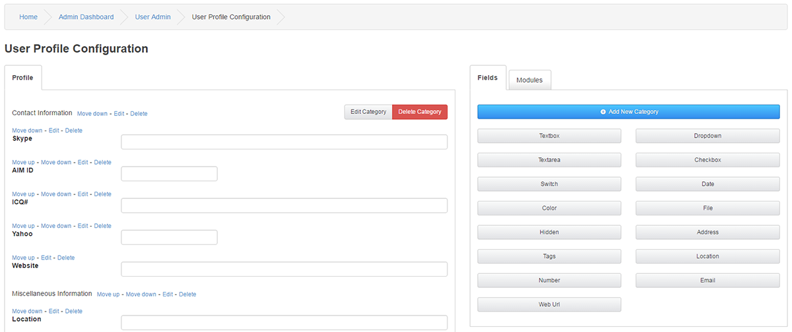

Select Category : Connected to User Field Categories, you can select where this Textbox belongs.I will put it in Miscellaneous Information for this example.

Field Title * : Give this field it´s purpose. We will ask about favourite GFX Card.

Add Language Translations, You can add a direct field translation for each installed language you have.

Field Name * : This is the table name stored in the database, keep it short and simple.

Field Default Value : The default value for this field.

Field Error Value : The error thrown if not completed as requested.

This is a required field : Tick this to force the users to fill out this field.

Field Log : Tick this to log the user action in the User Log.

Order : Select the order of the field

Field Registration : Tick this to display this User Field during site registration.

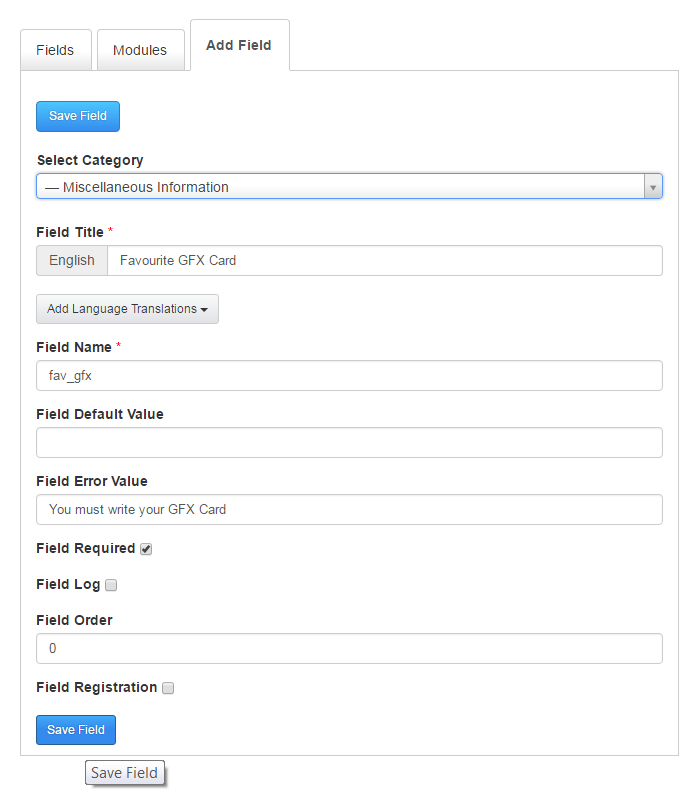

Once completed, click Save Field

The result is new required User Field asking the user for their Favourite GFX Card present under Miscellaneous Information.

It will be displayed under the registration if you selected this option. Otherwise, a manual Edit of the Profile is required as displayed above with the Geo Field.

Everyone on the site will see the field statement and the user input as we placed it in their profiles.

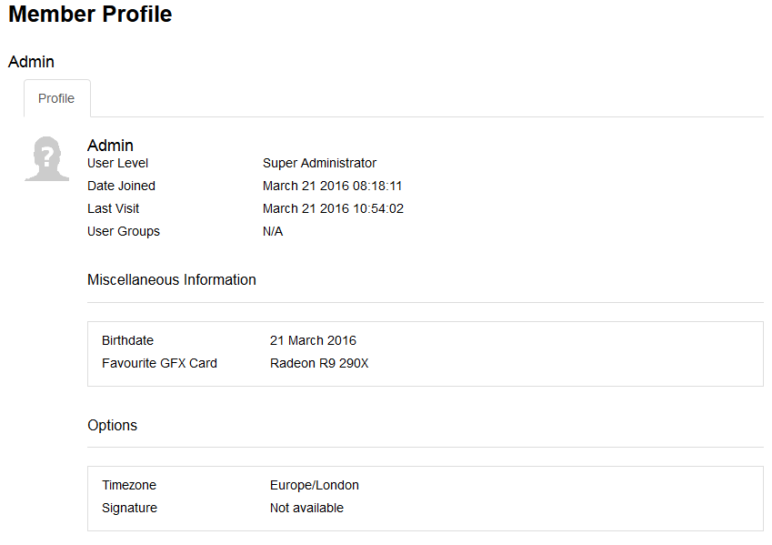

## Community created User Fields
You need to find and Download these User Fields from the Addon Database.
How to manage these fields can differ some depending on the developers.
Basic guidelines are that the fields need to be extracted from it´s archive and placed under the map includes/user_fields
Once placed as intended it should appear under the Modules tab and be handled just as any Core Field.

Modules

This is the container for your User Fields that are uploaded to your site´s includes/user_fields folder but not yet installed.
You click Install link on these and follow the instructions above to enable these.

Fields
This is the container for your customizable User Fields.
You click the type and follow the instructions above for Custom Fields to enable one of these.
