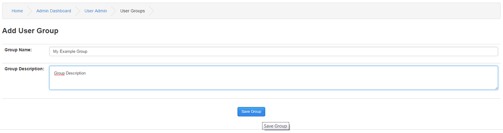
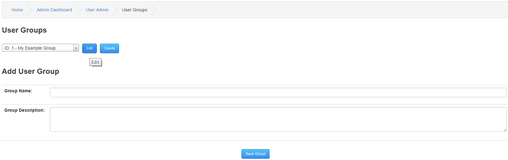
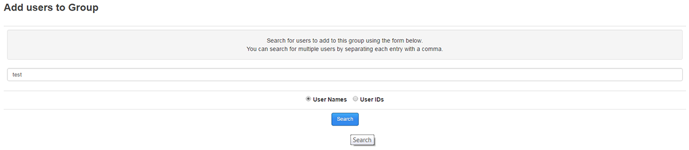
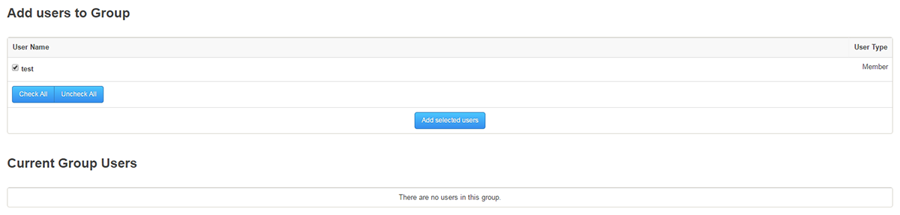
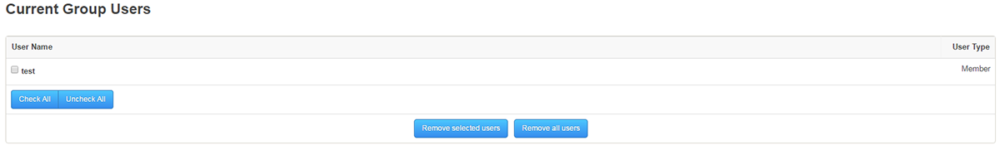

# User Groups

---

User Groups can be created to control access to different parts of your site such as specific Forum threads, News items , Custom pages etc.
When you Add or Edit content with access options on your site, you will be able to select any of your created User Groups for access restriction.

## Add User Group

Group Name : Enter the desired name of the User Group

Group Description : A brief description if wanted.

Once you have created a User Group, there will be a dropdown list displaying your User Group(s) with it´s unique ID.

You need to click edit before you can add members to a group.

Add users to Group

Enter a members name or their ID number and click search.
You can search for multiple users by separating each entry with a comma.

If the correct members are listed, tick the box beside the names and click Add selected users to populate your User Group.

Current Group Users

You can check each member in your User Group for removal, or you can remove all members in your User Group.
