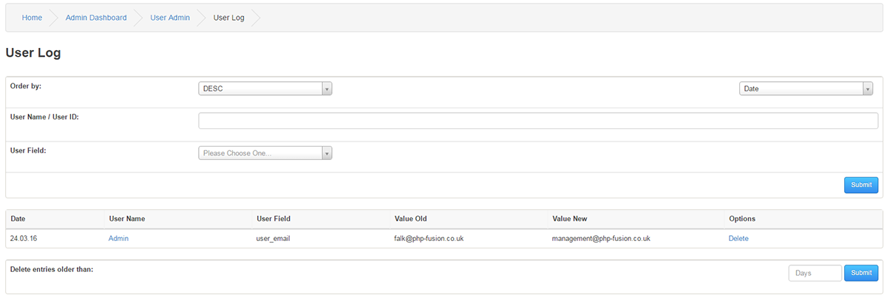

# User Log

---

All user actions are recorded here for any User Field that have Log User Fields enabled.
In essence, it will list the old value and the new value.
Username and User Email are two default fields that have this enabled on a basic installation.

Order by

Select the list order.

Username / User ID

The log can be searched by either Username or ID number.

User Field

Select a specific User Field to filter by.

Delete entries older than

You can delete entries older than:XXX days if you need to clear it out some.
