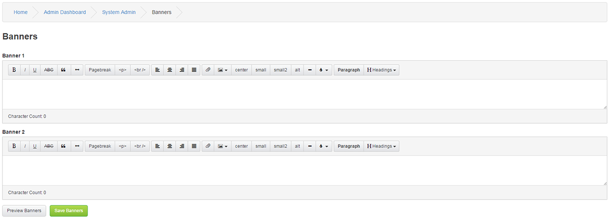

# Banners

---

If you want to replace your site logo with something else, or you want a second banner, image or even an advert, you can use this banner manager.

Please note that the Banner system is highly connected to individual Themes.

Banner 1

Enter the code or image path you wish to display in the left-hand side of your header, try testing with preview before putting it live.

Banner 2

Enter the code or image path you wish to display in the right-hand side of your header, try testing with preview before putting it live.
