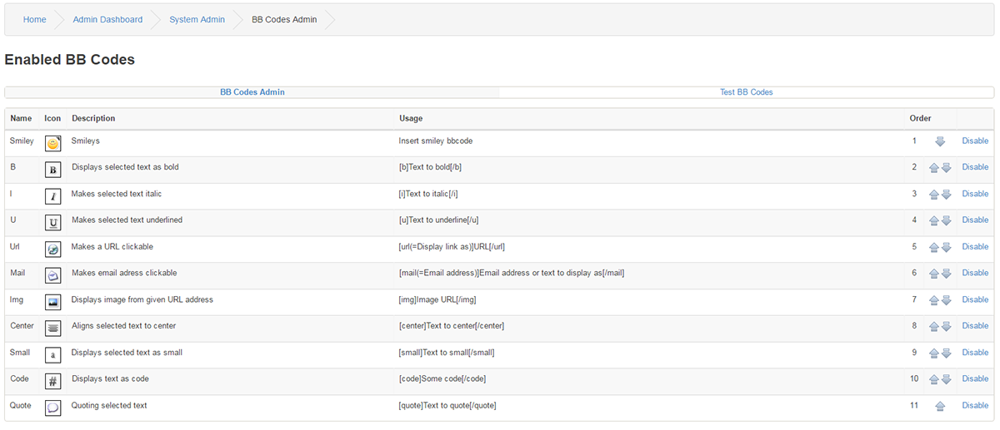
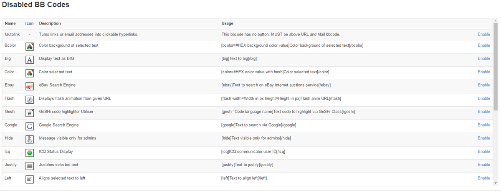

# BB Codes

---

BB Codes stand for Bulletin Board Codes.

BB Codes is a markup language used to format messages.

They are mostly a safe way for members to format the text in their postings without being able to input harmful code that could damage or be used to attack your site.

The BB Code Administration shows a top list of your enabled BB Codes and the bottom list shows a list of loaded but not enabled BB Codes.

It's a simple matter of enabling or disabling whichever ones you want,

The list shows the image to denote that BB Code as well as the code to use it on the site.

To make use of them on your site, just either click the image or type in the BB Code.

All Enabled BB Codes will automatically be displayed and selectable in your textboxes for Blogs, Messaging, Forum Posts, Comment´s, News and Article editors etc.

Installing BB Codes

All BB Codes should come with a clear instruction how to configure them.

The basics are that you extract the files and place the BB Codes under includes/bbcodes.
