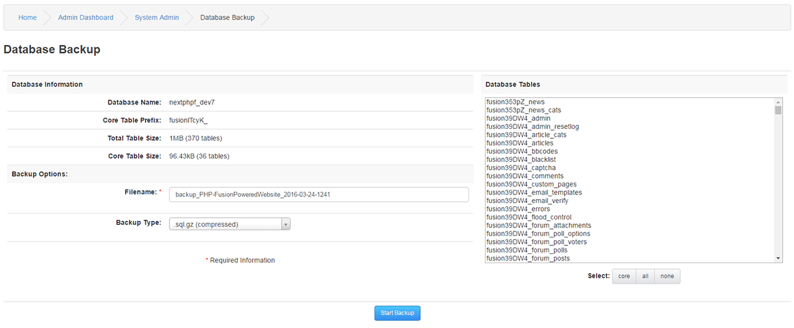
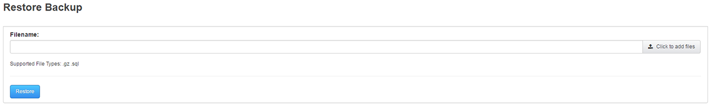

# Database Backup

---

It is strongly recommended to make regular backups of your Database.
You should make sure that you to this on regular intervals depending on how busy your site is.

You can select all your tables, individual tables or only Core tables.

You can name your backup to anything you want, and you can select between sql or zip file.

To restore a backup, simply browse for the file and click Restore.
