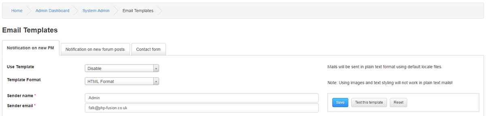
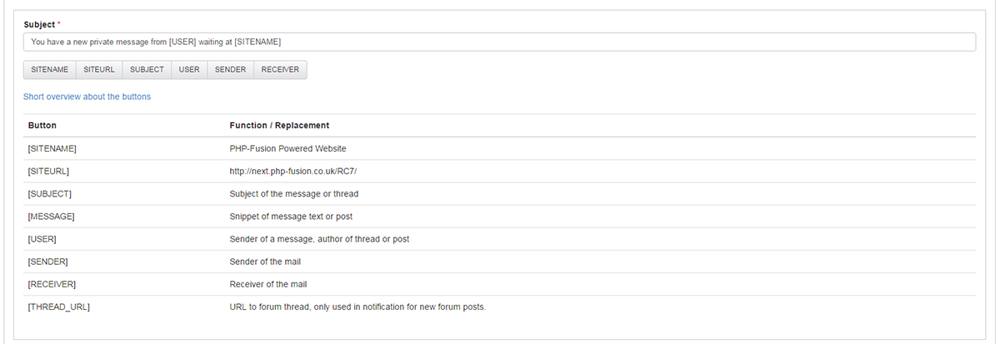
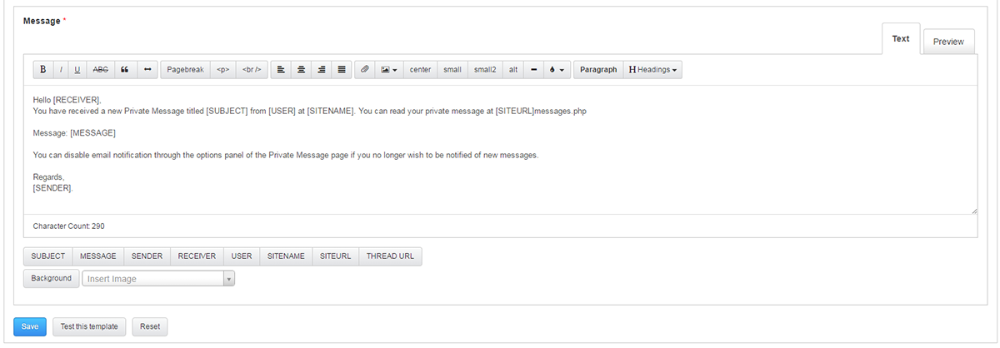

# Email Templates

---

Email Templates are customizable templates for user notifications from Private Messages , Forum posts and the Contact form.

The three pre-configured and supported examples are present in tabs.
Everything option in these are for most parts self-explanatory.

Use Template : Enabled or Disabled

Template Format : HTML / Plain Text

Sender name : The senders signature

Sender email : The senders email

You can test a template before putting it live, you can also reset a template to its original state.
