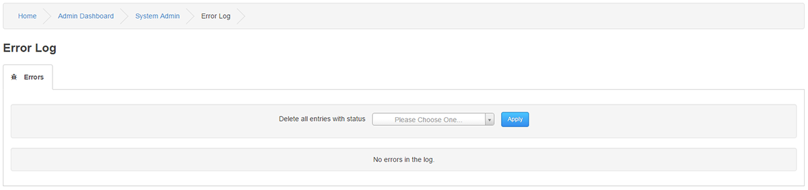

# Error Log

---

The Error Log is an automatic Administrators tool for logging errors and notices generated on your site.

If an error is detected a warning box will appear at the bottom of your site under the footer with a link to the Error Log itself.
The cause of the error can be viewed in the entry and once fixed, any or all log entries can be deleted.

