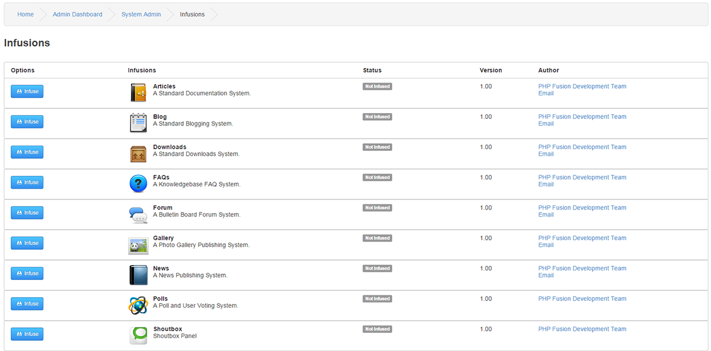

# Infusions

---

Install or Uninstall Addons for your site, we call Addons for Infusions.

An Infusion can be Infused [installed], Defused [un-installed], Upgraded.

Infusions : The names of all uploaded Infusions in your `infusions` folder.

Status : Not Infused, The Infusions have been uploaded but not yet Infused.

tatus : Infused, The Infusion have been Infused.

pgrade Available: These are displayed when installed infusions that have a new version uploaded but not yet updated.

You can Download Addons from our [Marketplace](https://www.php-fusion.co.uk/infusions/marketplace/)

Each Addon downloaded from PHPFusion Main should contain a readme file that explains how to install and configure you Infusion.
