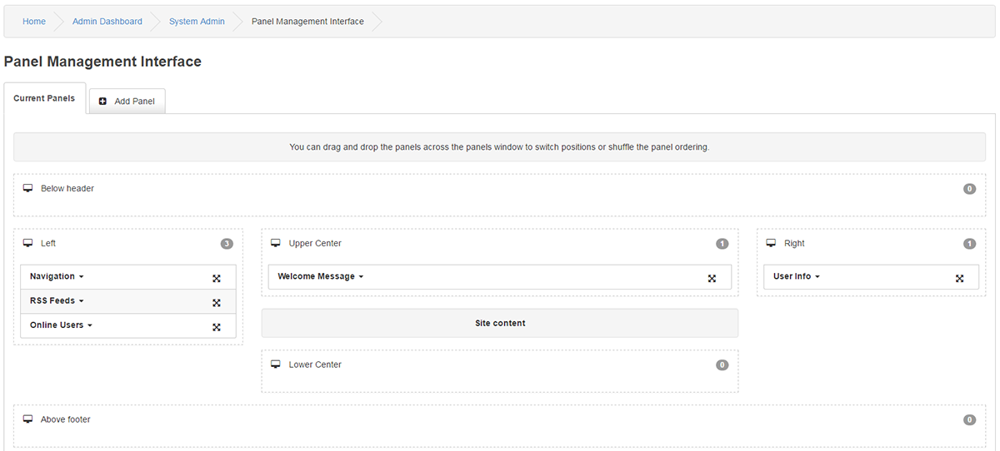
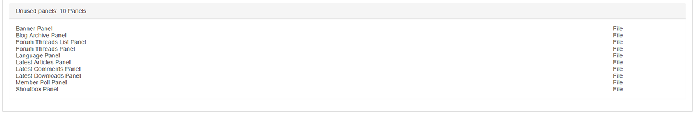
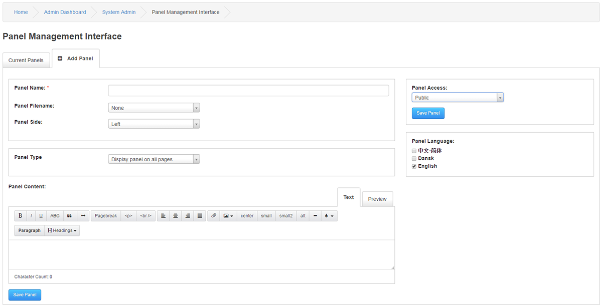

# Panels

---

The basic layout of a PHPFusion site are usually based on Panels unless you use a very customized Theme.

There are seven Panel Positions (left, below header, upper center, center, lower center, above footer and right).
Each Panel position is made up of a number of separate sub-Panels.
You can configure Panels in Panels Management.

The Panels page will show a visual list of all the Panel positions and the Panels that have been added to your site.
The Panel manager utilize "Drag and Drop" for arranging your Panels.

Panel Management Interface

Below Header

Left / Upper Center / Right

Lower Center

Above Footer

Added Panels are displayed in the above sections.

You will also find a section called Unused Panels, this section will list Panels that have been added to your directory but have yet been added to any Panel position.

## Add Panel

Panel Name : Your name for this Panel.

Panel Filename : List of uploaded Panels. Any Panel content will be ignored if selected.

Panel Side: Select where to place the Panel from the pre-defined positions.

Panel Content : If it is to be a code based Panel, enter the code into this field, You use the preview button to test content.

Panel Type: Select the mode for the panel

You can select between a few options in the restrictions,Display on all pages, Display on home page only Exclude on these pages or Include on these pages.

If the two later options have been selected you can type a filename as Panel restriction.

Panel Restriction: Examples: /news.php /forum/index.php, and it will only be displayed here.

Panel Language: This is the language selection from where this panel will be available. Please see Multilingual Content for more information.

Access : Select Access level for this Panel

Options

To the right of the Panel name there is a small down arrow, if you click this arrow you will find information and options.

The information is Panel Order, Access levels, Panel type.

The options are Edit, Disable and Delete.

Ordering Panels

Use the arrows to drag Panels from one side of your site to the other.
Use the arrows to drag Panels up or down depending on your needs.
If you have trouble with the drag and drop function, You can delete the Panel in question and use New Panel for the section you want it to be in instead.
