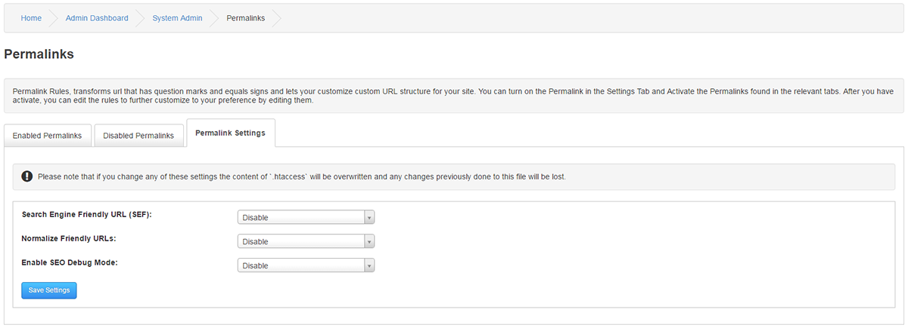
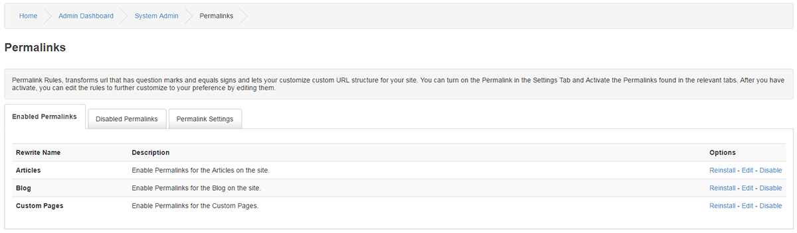
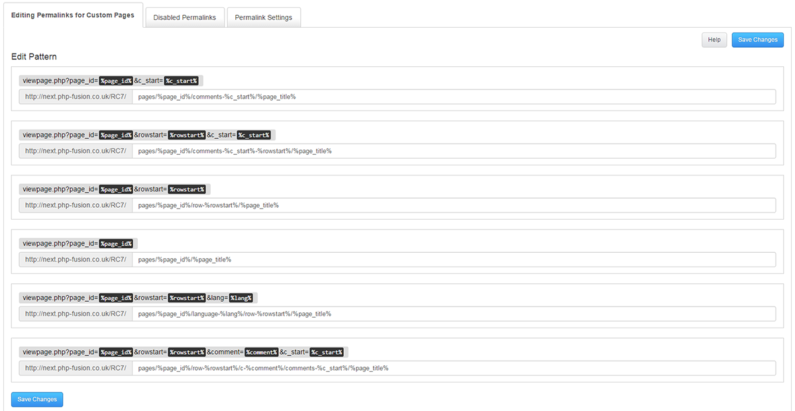

`# Permalinks

---

Permalink Rules will transform various site URLs to Search Engine Friendly URLs with powerful and flexible options to customize the complete URL structure of your site.

## Enable Permalinks Engine

Search Engine Friendly URL (SEF): Enable or Disable the Engine

Normalize Friendly URLs: Disable or Enable Normalize Engine.

The Normalize function will convert any special char to it´s nearest match.

Enable SEO Debug Mode: Disable or Enable the debug tool.

Please note that if you change any of these settings the content of .htaccess will be overwritten and any changes previously done to this file will be lost.

## Enabled Permalinks

You can see a full list of Enabled Permalinks under this tab.

ptions to Reinstall a Permalink. This is useful if you prefer to alter the Permalink rules on a file level found under includes/rewrites

f you do not re-install a Permalink after a rule change in the file, the changes will not be in effect.

emoving a Permalink will place it under Disabled Permalinks.

## Edit a Permalinks

You can directly alter the Permalink rules here, due to cache and environmental differences a file edit is recommended.

`
