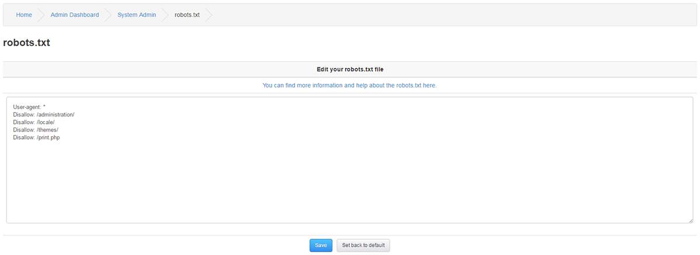

# Robots

---

Web Robots (also known as Web Wanderers, Crawlers, or Spiders), are programs that traverse the Web automatically.

Search engines such as Google use them to index the web content, spammers use them to scan for email addresses, and they have many other uses.

robots.txt can be used to identify restricted or private areas of a site's contents.
If you use it wrong, the information in the file may help an attacker to map out some of your site's more secret content, especially if some locations identified are not linked from elsewhere in the site.

If the application relies on robots.txt to protect access to these areas, and does not enforce proper access control over them, then the use of it can present a vulnerability.

You should not assume that all web robots will honor the file's instructions.

Rather, assume that attackers will pay close attention to any locations identified in the file.

Do not rely on robots.txt to provide any kind of protection over unauthorized access.

We have a default setup in robots.txt for crawl protected folders, but you can easily use this form to add your additions.

If you are uncertain of your changes you can click the set back to default button.
