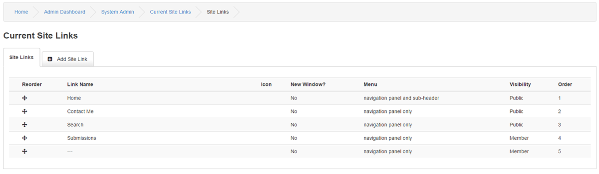
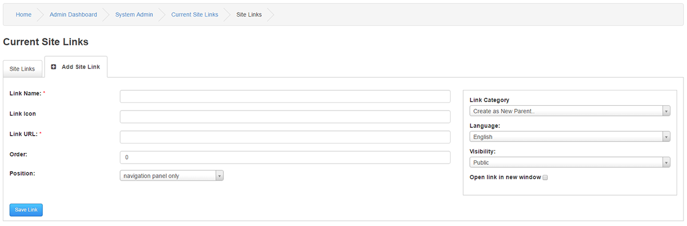

# Site Links

---

Site Links will add links in the Subheader and in the Navigation Panel.

The Navigation Panel must be enabled from Panels Management.

## Current Site Links

This displays a list of all existing links, use the arrows to drag them up or down for link ordering.

If you hover over a link you can select between Edit, Quick Edit, Delete, View.

## Add Site Link

Link Name : The name of the Link as it will appear in the Website.

You can also alter the name of the Link with the use of given Bold, Italic, Underline, Colour and Image BBCodes.

Link Icon : This is connected to the use of classes, Font-Awesome and Entype is native in 9, Example : fa fa-link fa-fw ( The fa-fw align the text to the middle of the icon )

Link URL is the Link address to which you want the Link points to.

For example:- For URL's outside your website : https://www.php-fusion.co.uk/infusions/addondb/addondb.php

For URL's inside your website : home.php

If you want to add a new line break in the link list, enter 3 minus signs [ --- ] into Link URL.

Order is the arrangement order of the Link by which it will appear in the Sub-Header or Navigation Panel.

Position is the placement of the Site Links. You have to choose the position where you want to Display the Site Link.

For Example:- If you want to Display the Site Link only in the top Sub-header, then select the option sub-header only

Link Category: Category Parent, As Parent means that you are creating a main link, if you have more categories you can have it as a child to a main link category in order to create sub category links.

Language: This is the language selection from where this link will be available. Please see Multilingual Content for more information.

Visibility is the visibility of the Link to others. It sets whether to show a Link to a Guest, Member, Administrator, Super Administrator or a Group or not.

Open link in new window checkbox allows you to configure a Site Link to open in a new Window, when Clicked by a User.

Drag and Drop Ordering

The Drag and Drop Ordering feature allows you to order your Site Links easily by Dragging them with the Help of Drag Icon .

To Order, just Left-Click the Drag Icon and Drag the Site.

You can also edit a link and manually type the order if you have any issues with the Drag and Drop Ordering feature.
