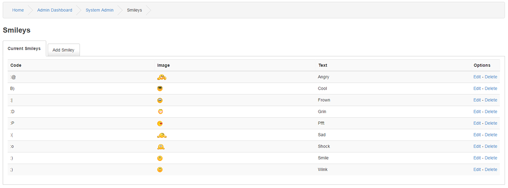
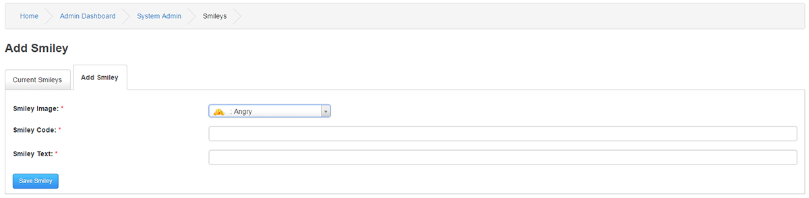

# Smileys

---

Smiley's are fun face images that are common on the internet and are used to express a particular emotion when posting.
All enabled Smiley's will automatically be available in the Shoutbox, Private Messages, Forum post forms, Comment post forms etc.

## Current Smileys

A list of current Smiley's which can be edited or deleted here.

## Add Smiley

To add new smiley, the image must first be uploaded to your images/smiley folder.

This cannot be done from inside PHPFusion and must be done direct to your server by your FTP client or any other file hander software you use.

Smiley Image : Choose the corresponding image from the dropdown menu.

Smiley Code : Enter the code a member can input to use your smiley.

Smiley Text : A word to denote emotion of this smiley.
