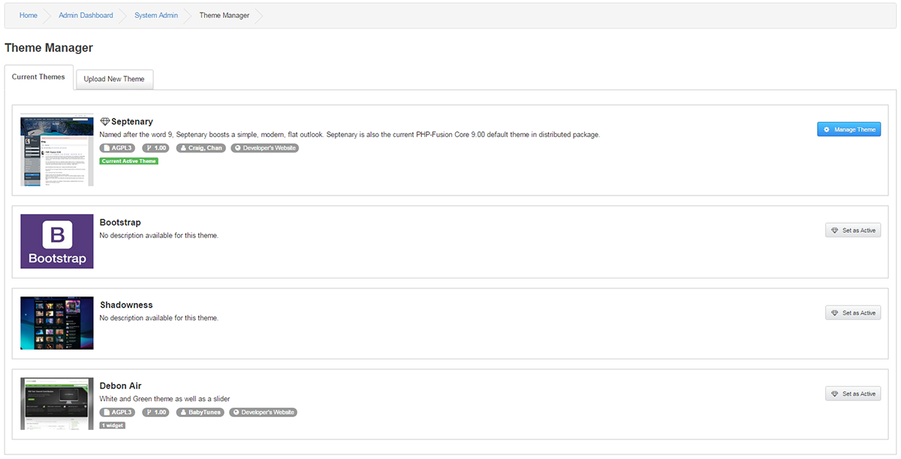
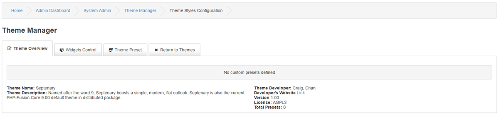
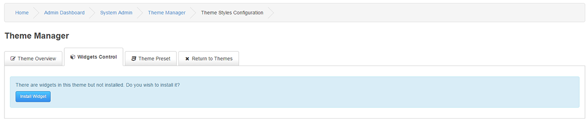

# Theme Manager

---

The Theme Manager will allow you to do specific CSS overrides for Bootstrap classes and to have your own set of preset configurations to any given Bootstrap based Theme.

## Site Themes

You can see a list of current themes uploaded with various information and a screenshot if one exist.

You can choose to Manage a Theme or to set a new Theme Active from this section.

## Manage Theme

Theme Overview

Theme Name: The name of selected Theme

Theme Description: Developers description of the Theme

Theme Developer: Developer(s) name(s)

Developer's Website Link: URL to the Developer(s)

Version: Current version

License: Theme license

## Widgets

If your Theme have a Widget developed to it, you can install and handle the Theme Widget from this section.

