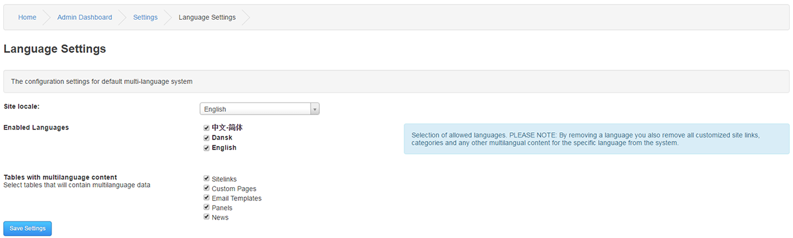

# Language

---

n this settings section you will be able to select your site´s primary language and also additional languages selectable.

Site locale: Select the primary language for your site.

Enabled Languages: Select the languages you want to enable for your site. These are downloaded from PHPFusion 9 Locales and placed under /locale/language. Please see SDK for Translators if you need to create a new locale for your language.

PLEASE NOTE: By removing a language you also remove all customized site links, categories and any other Core related multilingual content for the specific language from the system.

Tables with multilanguage content

Select tables that will contain multilanguage data.

Core components such as Sitelinks, Custom Pages, Email Templates, Panels are listed per default here.

By removing the check you will have the content for each section listed under all installed languages.

If you for example remove the Sitelinks, The site´s default language links will be listed under all languages.

New Infusions that are created can have a line with it´s unique identifier that automatically adds a setting to the Multilanguage Tables when you install it.

Once the setting is available you can toggle it globally by excluding or including the Infusion from Multilingual content.

Please see Multilingual Content for more information on how it is intended to work in PHPFusion.
