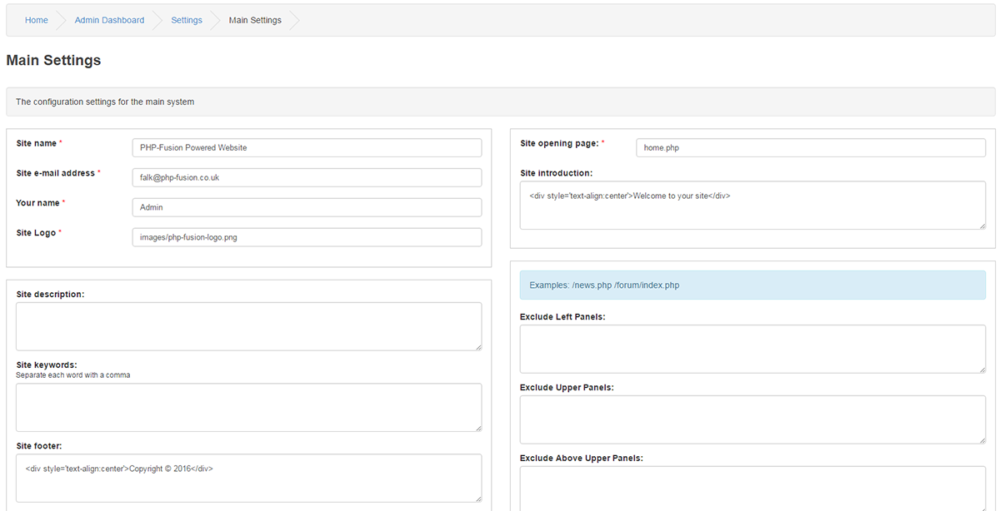

# Main Settings

---

This is the Main Site settings section.

Settings

Site name: Name of the site.

Site e-mail address: This is the site e-mail used for the contact.php form.

Your name: The site owners name.

Site Logo: Default banner for your site.

Site description: Used as meta tags for search engines.

Site keywords: Used as meta tags for search engines. You can have multiple keywords, each keyword need to be separated with a comma.

Site footer: Used by Themes to display a footer notice.
Default search location: Set´s where to start search by default

Site Protocol: Select https if your site is on a secure server, otherwise use http.

Site Host: The domain name of your site, e.g. www.mywebsite.com

Site Path: The folder level from root directory, e.g. /subfolder/ or just /

Site Port: If your site uses a non-standard server port.

Site opening page: * Default page all visitors will be brought to when first accessing your site.

Site introduction: Used by the welcome_message_panel for a short site introduction.
