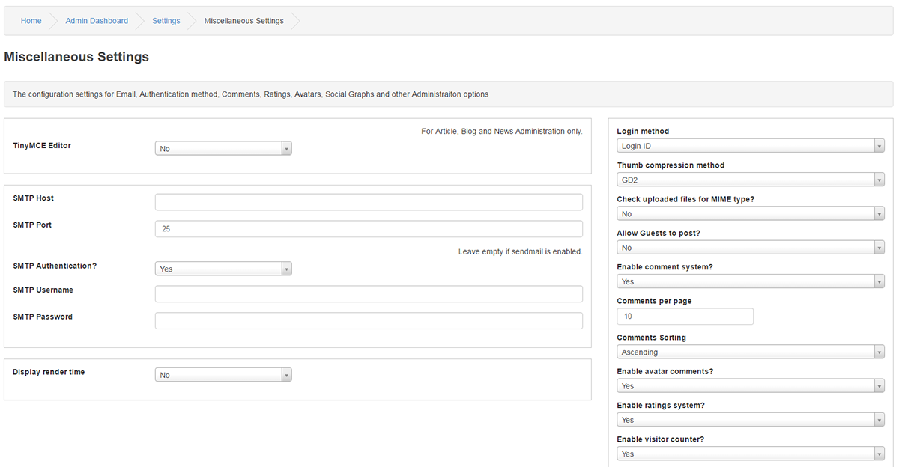

# Miscellaneous

---

TinyMCE HTML editor? Yes or No

TinyMCE is an easy-to-use word processor that comes included with PHPFusion.

If you have no experience of using HTML but need to format your posts then we would suggest that you use TinyMCE.

TinyMCE is primarily for Blog, News, Custom Pages and Articles in Administration.

Please note that PHP Coded Custom Pages can be re-formatted using TinyMCE.

SMTP Host

SMTP Port : 25

SMTP Authentication? Yes or No , Leave SMTP Authentication empty if sendmail is enabled.

SMTP Username :

SMTP Password :

SMTP stands for Simple Mail Transfer Protocol which is the Internet standard for e-mail transmissions.

You should check with your web host and your ISP for SMTP relaying info if you do not have a document with correct settings.

Display render time (in footer)? No, Yes all visitors or Yes only Admins

If the function is included with your Theme, the render time can be displayed in the site footer.

It is the time it takes for your page(s) to load.

Login method : Username or email or both, user can log in with their e-mail if enabled.

Thumb compression method: Default is GD2

Check uploaded files for MIME type? Yes or No, Utilize this security feature to check files for correct MIME type.

Allow Guests to post? Yes or No ( Only for Comment´s and Shoutbox )

A captcha check will be displayed to prevent automated bots from spamming your site.

However, if you allow this you will have no way of controlling who posts on your site.

Enable comment system? Yes or No ( Comments Sorting Ascending or Descending )

Allows for members to comments on posted content from News items, Photos, Articles etc.

If enabled, comments can usually be turned on or off for each individual section that supports commenting.

Comments per page: Amount of comments to list per page.

Comment sorting: Default sorting method for comments.

Enable avatar comments? Yes or No

This will show the user´s avatar in the comment´s if the function is enabled in your Theme.

Enable ratings system? Yes or No to display avatars or not.

Articles,Blogs,News Items,Articles,Photos and Custom pages can be rated by members if enabled.

You will have the choice to allow each individual item to be rated or not if enabled.

Enable visitor counter? Yes or No

Enables or disables the unique visitor counter in the footer of your site.

The counter will work in all Themes that have the showcounter function included.

Create OpenGraph meta tags for Social networks : Yes or No, Various sections have OG creation to it. This is a global toggler.

Allow index URLs in BB Codes: Yes or No, if set to no index-nofollow is added to BBCode generated URLs.

Allow index URLs in user profiles: Yes or No, if set to no index-nofollow is added to user website generated URLs. Default for User info under Profile and Forum.
