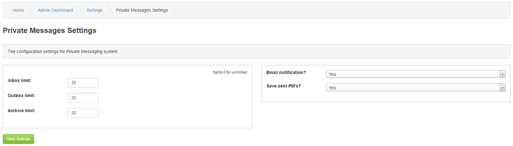

# Private Messages

---

Note that Individual user options take precedence if they're set for notifications and saving sent messages.

Inbox message limit:

This sets the number of Private Messages a user can have in their Inbox before it is full.

If the Inbox are full, the user can not receive more messages until room is made by deleting some or all messages

This limit does not apply to Administrators. Enter 0 value for unlimited Message boxes.

Outbox message limit: Same as for Inbox.

Archive message limit: Same as for Inbox.

Email notifications?

If set to yes a member will receive an e-mail alerting them if they receive a new Private Message.

Once set this choice will display in members message options.

Save sent PM's?

Your members may wish to keep a copy of sent Messages.

Once enabled, This choice will be available for members in their message options.
