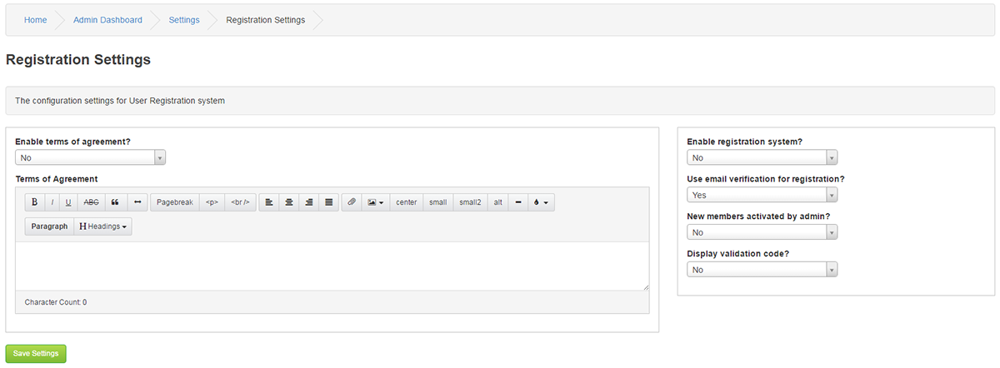

# Registration

---

Enable terms of agreement? Yes or No

You can insist that all new members registering on your site agree to certain terms and conditions set by you.

Terms of Agreement:

Enter your terms and conditions, there are text formatting buttons provided allowing you to format the text,add image(s) and links as desired.

Enable registration system? Yes or No

Allow members to register or not. When closed not new users will be able to sign up on your site.

Use email verification for registration? Yes or No ( See Miscellaneous > SMTP Settings ).

You can verify member's e-mail address by turning this setting on.

The person registering will receive an e-mail with an individual link they have to click in order to activate their account.

New members activated by admin? Yes or No

If set to Yes, no new members accounts will be activated unless approved by an Administrator.

Display validation code? Yes or No

The validation code is displayed in the registration form, it helps prevent automatic registrations by spambots and other malicious software.

It is strongly recommended you leave this on. (See Security Settings > Captcha)
