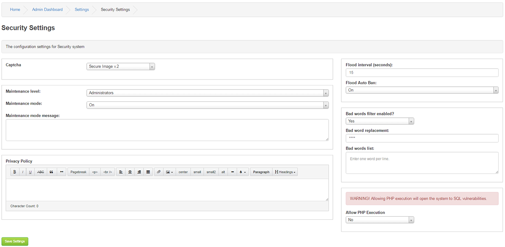

# Security

---

Captcha Settings:

Captcha is the auto generated verification code used in several places on your site as a security precaution to prevent automated programs known as bots from gaining access to your site through the form.

Choose which of the three captchas you wish to use. If you choose reCaptcha, you will need to acquire your free "Keys" first.

Maintenance level:

Set the user level of who can access the site while it is in maintenance mode. [N.B.. Site owner is user id #1]

Maintenance mode:

Selecting On will put the site into maintenance mode which prevents guests and members [and admins, if level set] from accessing the site.

They will be greeted by the maintenance page containing the message you enter.

Those of sufficient level who can still access the site will see a warning at the top as a reminder that the site is locked out.

Maintenance mode message:

This is the message guests and members will see when visiting the site.

Privacy Policy

Statement about the site´s Privacy Policy.

Flood interval (seconds):

This sets the time in seconds during which a member cannot post again.

Flood Auto Ban:

If any member or automated bot breaks the flood limit, they will be automatically banned.

Bad words filter enabled?

This will enable a filter to prevent users from using language that you or your visitors may find objectionable or to prevent certain spam words from being entered.

Bad words list:

If enabled, enter each word you wish to block, one word per line. Enter as many as you like.

Bad word replacement:

This is what will display instead of the offending word.
