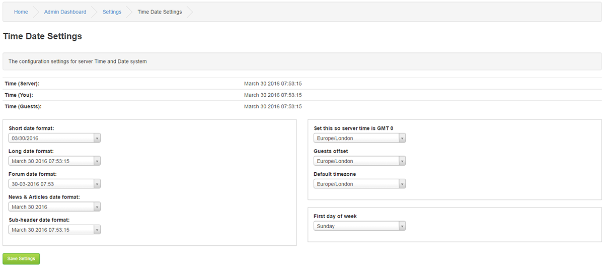

# Time and Date

---

Use these settings to alter how the time and/or dates display around your site.
Select the format required and then click the >> button to set it. Once all formats are set, click Save Settings to update the database.

Time (Server): Server time

Examples of time formats,

Settings - Time and Date

Short date format:10/29/2014

Long date format: October 29, 2014 09:31:09

Forum date format: 29-10-2014 09:31

News & Articles date format: October 29, 2014

Sub-header date format: October 29, 2014 09:31:09

Server offset (Set this so server time is GMT 0)

Default timezone : Select default time zone

First day of week : Set the day your week starts
