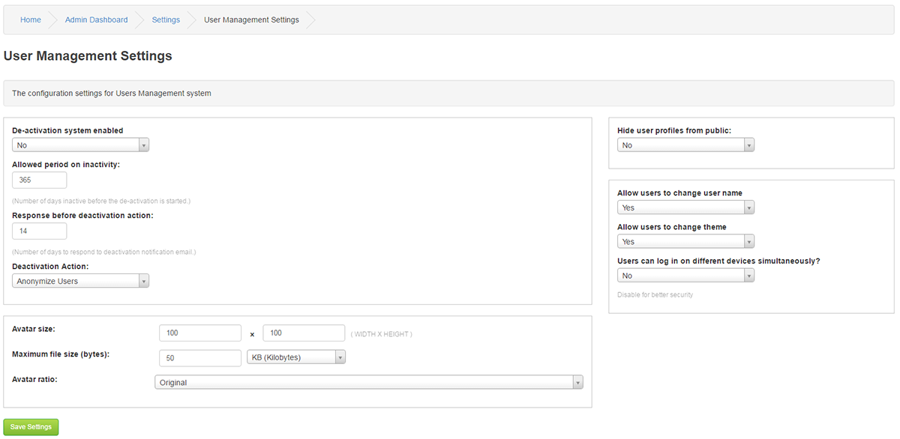

# User Management

---

De-activation system enabled:

The De-activation system depending on settings below allows for automatic handling of inactive users.

Allowed period on inactivity:

Number of days inactive before the de-activation is started. Default is 1 year.

Response before deactivation action:

Number of days to respond to deactivation notification email. Default is set at 2 weeks.

Deactivation Action:

Choose between user account deletion or Anonymize user.

Anonymizing a user replaces their username wherever it is appears on your site with "Anonymous User". N.B. Admins and above can still view the username.

Avatar size

Set the maximum height and width for your users avatars.

Maximum image size:

Set the maximum filesize for your users avatars.

Avatar ratio: Original or Square.

Hide user profiles from public:

If you do not want your users profile to be publicly visible, select no.

Allow users to change username?

Allowing users to alter their usernames could cause confusion.

However, if choose to do so it would be a good idea to enable logging on the username user field to keep track of whose.

Allow users to change theme?

If enabled users can change the theme they view the site in from you Themes directory.

Users can log in on different devices simultaneously

Yes or No,

If not enabled you will be automatically logged out on your Working compter when logging on your home computer and vice versa.
